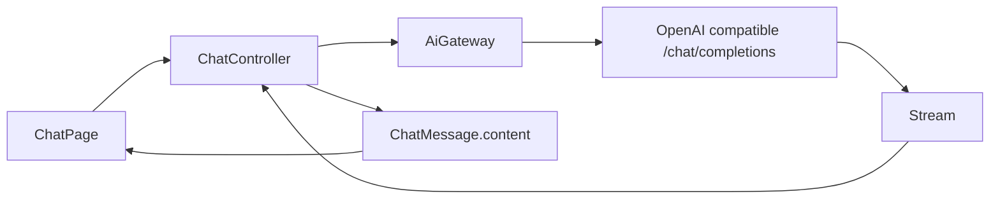
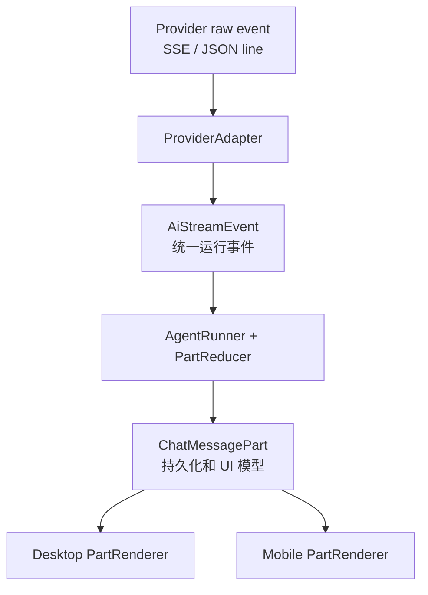
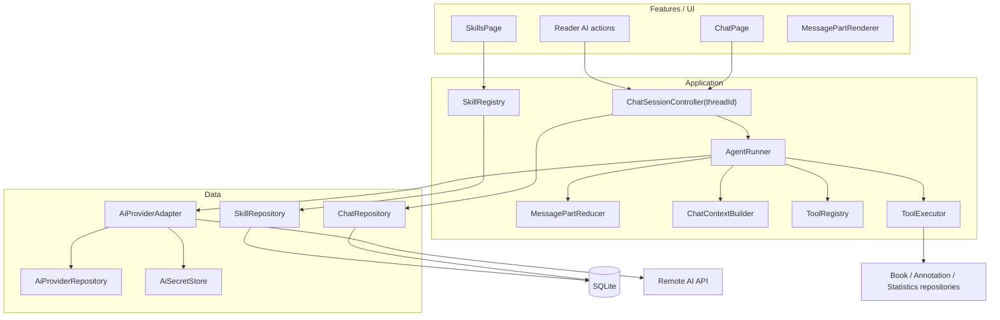

# TomoRead AI Agent 对话实现规范

> 更新日期: 2026-08-02  
> 适用范围: AI API、流式对话、思考摘要、工具调用、技能执行、引用、桌面和移动端展示  
> 文档性质: 后续开发的主实现规范

## 1. 文档目的

本文基于 TomoRead 当前源码和 `reference/ReadAny` 的实际实现，定义一套可以直接开发、测试和迁移的 AI Agent 架构。目标不是只把 ReadAny 的组件外观搬到 Flutter，而是让下列能力从 API 到数据库再到 UI 使用同一个数据契约:

1. 普通流式文本;
2. 供应商提供的思考摘要;
3. 工具参数流、工具执行和工具结果;
4. 内置及自定义技能的选择、执行和结果;
5. 书籍原文引用和可跳转来源;
6. 中止、失败、重试、用量和完成原因;
7. Windows、Linux、Android 上一致的消息顺序和状态。

本文取代 `.agent/ai-chat-architecture.md` 中关于“当前实现状态”“只支持纯文本消息”和“工具调用暂不实现”的部分。原文仍可作为第一版基础对话的历史设计记录。

## 2. 源码审计结论

### 2.1 TomoRead 当前实现

当前链路为:



已经完成且应保留的能力:

- API Key 使用系统安全存储，不进入 SQLite;
- Base URL 默认要求 HTTPS，仅对本机地址放宽;
- 支持基础 OpenAI Chat Completions SSE、停止生成和错误映射;
- 会话、消息和引用已经持久化;
- 阅读器选区可以创建 `PendingChatDraft` 并进入书籍会话;
- 桌面双栏与移动端会话抽屉已经存在;
- 系统提示中已经有原文和指令的边界处理。

阻止 Agent 能力继续扩展的问题:

| 层级 | 当前实现 | 直接后果 |
| --- | --- | --- |
| API | `AiGateway` 只返回 `Stream<String>` | 无法表达 reasoning、tool call、usage、stop reason |
| SSE | 只读取 `choices[0].delta.content` | 工具参数增量和供应商专用事件全部丢失 |
| 消息 | `ChatMessage` 只有一个 Markdown `content` | 正文、思考、工具和技能无法保持到达顺序 |
| 引用 | 选区被机械复制为用户和助手引用 | 不能证明助手实际使用了该来源 |
| 历史 | 最近 20 条消息按数量截取 | 不考虑 token、消息配对和工具往返完整性 |
| 运行状态 | 全局只有一个 `isStreaming` | 切换会话会受阻，无法按会话维护运行状态 |
| 数据库 | schema v10 无 parts、runs、tools、skills | 重启后无法恢复 Agent 执行记录 |
| UI | 每条消息只渲染一个 Markdown 卡片 | 没有思考、工具、技能、终止等专用视图 |
| 性能 | 每个文本增量可能重建 Markdown 和滚动列表 | Android 容易出现明显卡顿 |
| 技能 | `SkillsPage` 是静态卡片 | 无持久化、启停、参数、执行或结果 |

另外，当前附带的选区只在本轮系统提示中有效。后续请求从 `ChatMessage.content` 重建历史时不会重新带上选区内容，因此多轮追问可能失去原始依据。失败、取消和空助手消息也可能进入后续上下文。

### 2.2 ReadAny 可借鉴的部分

ReadAny 的核心不是某个聊天组件，而是 `MessageV2.parts`:

- 一条消息由 `text`、`reasoning`、`tool_call`、`citation`、`quote`、`mindmap`、`mermaid`、`aborted` 等 Part 按到达顺序组成;
- 流式阶段原地更新当前 Part，而不是把所有内容拼成一段字符串;
- 工具具有 `pending/running/completed/error` 生命周期;
- 桌面和移动端使用相同的 Part 语义，只更换平台布局;
- 推流状态发布有节流，取消时会补充可见的 aborted Part;
- 技能会转换为模型可调用的工具，并与普通工具一起注册;
- 正在生成时只在用户接近列表底部时自动滚动。

ReadAny 仍有不应直接照搬的点:

- 工具结果主要按工具名寻找最近的未完成 Part，同名并行调用时可能匹配错误; TomoRead 必须使用 `callId`;
- 消息 Part 主要以多个 JSON 字段反序列化; TomoRead 已使用关系型 SQLite，增量写入和查询更适合独立 `chat_message_parts` 表;
- ReadAny 使用 LangChain/LangGraph; TomoRead 不需要引入同等重量的运行时，可以实现一个明确、可测试的小型 Agent 循环;
- 完整 reasoning 不应被假设为所有供应商都能或都应该展示，TomoRead 应以“供应商返回的用户可见思考摘要”为契约。

### 2.3 Lumina 的参考边界

Lumina 的重点是移动 EPUB 阅读体验，没有可对标的完整 AI Agent 链路。因此本模块以 ReadAny 的交互和消息结构为主要参考，保留 TomoRead 的 Flutter、Riverpod、Repository 和 SQLite 架构。

## 3. 核心设计原则

### 3.1 一条助手消息是有序 Part，不是一个字符串

以下流必须保持原始顺序:

```text
思考摘要 -> 调用 searchBookText -> 工具结果 -> 思考摘要 -> 正文 -> 引用
```

不能将 reasoning 固定放在正文上方，也不能将所有工具卡固定放在正文下方。供应商和 Agent 发出事件的顺序就是最终消息的 `ordinal` 顺序。

### 3.2 三层模型严格分离



- 原始事件只存在于 Provider adapter 内;
- `AiStreamEvent` 是 API 适配层和 Agent 运行时的边界;
- `ChatMessagePart` 是 Repository、状态管理和 UI 的边界;
- Widget 不解析供应商 JSON，也不根据文本内容猜测 Part 类型。

### 3.3 思考过程的产品和安全定义

界面统一使用“思考摘要”，不要承诺“完整思维链”。实现必须遵守:

1. 只显示供应商明确返回、允许呈现给用户的 reasoning summary/thinking content;
2. 没有摘要时只显示瞬时状态“正在思考”，不得根据工具名或等待时间伪造推理文本;
3. Gemini thought signature、供应商加密状态、内部 item ID 等只作为不透明续传数据保存，不显示、不写日志、默认不导出;
4. 深度思考开关只映射到当前模型声明支持的 reasoning effort/summary 参数;
5. 供应商不支持时隐藏开关，而不是发送无效字段;
6. 完整响应日志默认不得记录 reasoning、原文上下文、工具结果或 API Key。

### 3.4 工具与技能使用同一执行基础设施

技能在模型协议层可以暴露为 function tool，但领域和 UI 中应保留 `skill_call` 类型。这样用户可以区分“搜索原文”与“章节总结技能”，技能页也能复用相同执行结果。

### 3.5 先只读，再开放写操作

第一阶段工具全部只读。任何创建笔记、添加高亮、修改标签等写操作都必须有显式确认、参数预览和审计记录。模型不能绕过 Repository 直接操作数据库或阅读器 WebView。

## 4. 目标分层架构



依赖方向固定为 `features -> application/domain -> data`。`AgentRunner` 只依赖抽象接口，不能依赖 Flutter Widget、`BuildContext` 或具体 HTTP client。

## 5. 推荐目录结构

```text
lib/
  domain/ai/
    ai_capabilities.dart
    ai_run.dart
    ai_stream_event.dart
    chat_message_part.dart
    tool_definition.dart
    skill_definition.dart
  application/ai/
    agent_runner.dart
    message_part_reducer.dart
    chat_context_builder.dart
    context_budgeter.dart
    tool_executor.dart
    tool_permission_policy.dart
  data/ai/
    adapters/
      ai_provider_adapter.dart
      openai_chat_adapter.dart
      openai_responses_adapter.dart
      anthropic_messages_adapter.dart
      gemini_interactions_adapter.dart
    streaming/
      sse_decoder.dart
      json_line_decoder.dart
    repositories/
      chat_repository.dart
      ai_provider_repository.dart
      skill_repository.dart
  features/chat/
    chat_page.dart
    chat_session_controller.dart
    chat_providers.dart
    widgets/
      message_list.dart
      message_part_renderer.dart
      text_part_view.dart
      reasoning_part_view.dart
      tool_call_part_view.dart
      skill_call_part_view.dart
      citation_part_view.dart
      quote_part_view.dart
      aborted_part_view.dart
      chat_composer.dart
  features/skills/
    skills_page.dart
    skill_editor_page.dart
    skills_controller.dart
```

如果现有项目暂不增加 `application/` 顶层目录，可先放入 `lib/features/chat/application/`，但接口边界不能省略。

## 6. 领域模型

### 6.1 Message Part

建议使用 Dart sealed class。所有 Part 共有:

```dart
sealed class ChatMessagePart {
  const ChatMessagePart({
    required this.id,
    required this.messageId,
    required this.ordinal,
    required this.status,
    required this.createdAt,
    required this.updatedAt,
  });

  final String id;
  final String messageId;
  final int ordinal;
  final PartStatus status;
  final DateTime createdAt;
  final DateTime updatedAt;
}

enum PartStatus { pending, running, completed, error }
```

必须支持的 Part:

| 类型 | 关键字段 | 用途 |
| --- | --- | --- |
| `TextPart` | `text` | 助手 Markdown 正文或用户文本 |
| `ReasoningSummaryPart` | `text`, `reasoningType` | 供应商可见思考摘要 |
| `QuotePart` | `text`, `bookId`, `locator`, `chapterTitle` | 用户主动附加的原文 |
| `ToolCallPart` | `callId`, `toolName`, `arguments`, `result`, `error`, `duration` | 普通工具生命周期 |
| `SkillCallPart` | `callId`, `skillId`, `skillName`, `skillVersion`, `arguments`, `result`, `error` | 技能生命周期 |
| `CitationPart` | `citationIndex`, `bookId`, `locator`, `quote` | 经校验、可跳转的来源 |
| `ArtifactPart` | `artifactType`, `title`, `payload` | 思维导图、Mermaid 等结构结果 |
| `NoticePart` | `level`, `message`, `code` | 可恢复警告和系统提示 |
| `AbortedPart` | `reason` | 用户取消或应用中断 |

`TextPart` 可有多个。模型在工具调用前后输出的正文不得合并，否则会破坏顺序。

### 6.2 Run 与 Tool Execution

`AiRun` 表示一次从用户发送到助手最终完成的运行:

```dart
enum AiRunStatus { queued, streaming, waitingForTool, completed, failed, cancelled }

class AiRun {
  final String id;
  final String threadId;
  final String userMessageId;
  final String assistantMessageId;
  final String providerProfileId;
  final String modelId;
  final AiRunStatus status;
  final String? providerResponseId;
  final String? stopReason;
  final AiUsage? usage;
}
```

每个工具执行必须由 `runId + callId` 唯一标识。禁止按工具名寻找结果对应项。

### 6.3 Provider 能力声明

```dart
class AiCapabilities {
  final bool streaming;
  final bool tools;
  final bool parallelTools;
  final bool reasoningSummary;
  final bool usage;
  final bool requiresOpaqueReplayState;
  final bool modelList;
}
```

能力来自适配器默认值和 Provider 配置，不由 UI 猜测。模型切换时，输入区根据能力动态显示深度思考、工具和用量选项。

## 7. 统一流式事件

将当前 `Stream<String>` 改为:

```dart
abstract interface class AiProviderAdapter {
  AiStreamHandle stream(AiRequest request);
  AiCapabilities capabilities(AiProviderProfile profile);
}

class AiStreamHandle {
  final Stream<AiStreamEvent> events;
  final Future<void> Function() cancel;
}
```

应用层至少识别:

```dart
sealed class AiStreamEvent {}

final class RunStarted extends AiStreamEvent { /* responseId, model */ }
final class TextDelta extends AiStreamEvent { /* providerPartId, delta */ }
final class ReasoningDelta extends AiStreamEvent { /* providerPartId, delta */ }
final class ToolCallStarted extends AiStreamEvent { /* callId, name */ }
final class ToolArgumentsDelta extends AiStreamEvent { /* callId, delta */ }
final class ToolCallReady extends AiStreamEvent { /* callId, parsedArguments */ }
final class UsageUpdated extends AiStreamEvent { /* token usage */ }
final class ProviderPartCompleted extends AiStreamEvent { /* providerPartId */ }
final class RunCompleted extends AiStreamEvent { /* stopReason, replayState */ }
final class RunFailed extends AiStreamEvent { /* normalized error */ }
```

工具执行事件由 `AgentRunner` 追加:

- `ToolExecutionStarted`;
- `ToolExecutionCompleted`;
- `ToolExecutionFailed`;
- `ToolConfirmationRequired`;
- `CitationProduced`;
- `ArtifactProduced`。

### 7.1 PartReducer 规则

1. 第一次 `TextDelta` 创建一个 running `TextPart`; 相邻同源增量更新该 Part;
2. reasoning、tool 或 skill 事件打断文本后，后续正文创建新的 `TextPart`;
3. 工具参数增量按 `callId` 缓冲，收到 ready 或 part complete 后才解析 JSON;
4. JSON 不完整时不得执行工具;
5. `ToolExecutionStarted` 将对应 Part 置为 running;
6. 结果和错误只按 `callId` 回填;
7. `RunCompleted` 关闭所有可关闭 Part; 未返回结果的工具标为 error;
8. 取消时保留已收到文本，并追加 completed `AbortedPart`;
9. 任何未知供应商事件记录 event name 和安全元数据后忽略，不能导致整次流崩溃。

## 8. Provider 适配策略

### 8.1 OpenAI compatible Chat Completions

保留当前 `/chat/completions` 作为兼容入口，但重写解析器:

- 支持 SSE 注释、空行分隔、多 `data:` 行、UTF-8 分片和 `[DONE]`;
- 解析 `delta.content`、`delta.tool_calls[*].id/name/arguments`;
- 收集 `finish_reason`、响应 model/id 和可用 usage;
- 对非 SSE Content-Type、空响应和流中错误事件给出明确错误;
- 连接超时、首 token 超时、流空闲超时分开配置;
- 自定义兼容服务的 reasoning 字段只能在 profile 声明映射后启用。

### 8.2 OpenAI Responses

新增独立 `openaiResponses` 协议，不与 Chat Completions 用条件分支混在一个文件。它负责把有序 output item、reasoning summary、function call、function output、usage 和状态事件映射到统一事件。

优先级建议: 新建官方 OpenAI 配置默认使用 Responses; 既有自定义兼容端点继续使用 Chat Completions，避免破坏 Ollama、One API 等兼容服务。

### 8.3 Anthropic Messages

按 `content_block_start/delta/stop` 的 index 维护 block 状态。必须支持:

- `text_delta`;
- `input_json_delta` 的工具参数缓冲;
- 可见 thinking/summary 增量;
- `message_delta`、`message_stop` 和 usage;
- ping 和未来未知事件的兼容忽略。

### 8.4 Gemini

Gemini 适配器负责 function call、function result、thought summary 和不透明 thought signature。signature 必须原样续传，不能解析、展示或丢失。工具结果必须携带对应 call ID，保证多轮和并行调用正确。

### 8.5 请求历史重建

历史构建不再只传 `message.content`:

- 发送已完成的用户文本和 quote;
- 发送助手正文、工具调用以及对应工具结果;
- 按适配器要求带上不透明 replay state;
- 排除 failed、cancelled 的 UI notice 和空消息;
- 若保留部分取消回答，必须作为明确的 partial assistant 内容处理;
- 用 token 预算裁剪完整 turn，不能把 tool call 和 tool result 拆开;
- 超预算时先使用线程 memory summary，再移除最老的完整 turn。

## 9. AgentRunner

TomoRead 不需要引入 LangGraph。建议实现可预测的显式循环:

```text
1. 创建 user message、assistant message 和 ai_run
2. 构建上下文快照与可用工具
3. 调用 Provider adapter
4. 将流事件归并为 parts
5. 若模型请求工具:
   a. 校验工具名、参数 schema 和权限
   b. 写入 tool/skill part 状态
   c. 执行工具并持久化结果
   d. 把工具结果发回模型，继续下一轮
6. 无工具请求时完成 run
7. 达到轮数、时间或 token 上限时以明确 Notice 结束
```

默认限制:

- 单次 run 最大模型往返 8 次;
- 单工具默认超时 20 秒，可按工具覆盖;
- 工具结果正文默认上限 32 KiB，超出后截断并附元数据;
- 只读工具可并行，但结果必须按 call ID 回填到原 Part;
- 写工具串行且逐项确认;
- 每个 thread 同时最多一个 active run;
- Controller 内部使用 `Map<threadId, run>`，允许用户切换到其他会话。

停止操作必须同时取消 HTTP 流和工具 cancellation token。应用关闭或崩溃后再次启动，应将遗留的 streaming/running 状态改为 cancelled/error，并追加“上次运行意外中断”，不得自动重放写工具。

## 10. 工具体系

### 10.1 ToolDefinition

```dart
class ToolDefinition {
  final String name;
  final String displayName;
  final ToolKind kind;
  final Map<String, Object?> inputSchema;
  final ToolPermission permission;
  final Set<ChatScope> scopes;
  final Future<ToolResult> Function(ToolContext, Map<String, Object?>) execute;
}

enum ToolKind { read, write, skill }
enum ToolPermission { automatic, confirmEveryTime, denied }
```

工具通过 Registry 注册，`AgentRunner` 只拿当前 scope、书籍能力和用户设置允许的子集。工具实现必须调用现有 Repository/Service，不能直接拼 SQL。

### 10.2 首批只读工具

| 工具 | 作用 | 前置条件 |
| --- | --- | --- |
| `getCurrentReadingLocation` | 当前书、章节、locator、进度 | 书籍会话 |
| `getCurrentChapter` | 当前章节的受限文本 | EPUB 已打开 |
| `getTableOfContents` | 获取目录 | 书籍会话 |
| `searchBookText` | 原文检索并返回 locator | 先完成全文索引 |
| `getAnnotations` | 查询当前书标注和笔记 | 书籍会话 |
| `searchGlobalNotes` | 查询全局笔记 | 用户显式允许全局上下文 |
| `getReadingStatistics` | 获取阅读统计摘要 | 通用或书籍会话 |
| `listLibraryBooks` | 查询书库元数据 | 通用会话 |

`CitationProduced` 只能来自能返回稳定 `bookId + locator + quote` 的检索/上下文工具。模型仅输出 `[1]` 不能凭空创建引用。

### 10.3 后续写工具

- `createNote`;
- `addHighlight`;
- `updateAnnotation`;
- `updateBookTags`。

每次执行前展示工具名、目标书籍、核心参数和影响范围。确认结果也要写入 `ai_tool_executions`，但不得把隐私数据写到诊断日志。

## 11. 技能体系

### 11.1 SkillDefinition

```dart
class SkillDefinition {
  final String id;
  final String name;
  final String description;
  final String iconKey;
  final bool enabled;
  final bool builtIn;
  final int version;
  final String promptTemplate;
  final Map<String, Object?> parameterSchema;
  final Set<ChatScope> scopes;
}
```

内置技能以代码中的默认定义为源，SQLite 只保存用户覆盖项; 自定义技能完整保存。合并键为稳定 `skillId`，不能按名称合并。

首批把现有技能页中的能力真正落地:

1. 章节总结;
2. 概念解释;
3. 结构分析。

第二批可增加人物追踪、论点分析、阅读指导、翻译和词汇助手。

### 11.2 技能如何执行

技能通过 `skillToTool` 暴露给模型，但运行时产生 `SkillCallPart`:

```text
模型选择 skill_chapter_summary
-> ToolRegistry 查找对应 SkillDefinition
-> 校验参数和 scope
-> SkillRunner 合成技能提示与受限上下文
-> 继续调用模型或返回结构结果
-> 更新 SkillCallPart
```

技能有三个入口，最终都进入同一个 `AgentRunner`:

- 对话中由模型自动选择已启用技能;
- 技能页点击运行，填写参数后打开/创建对应会话;
- 阅读器选区菜单显式选择技能。

技能卡显示名称、图标、参数摘要、running/completed/error 和耗时。完整 prompt 默认只在技能编辑器中显示，不在聊天记录展开，以免暴露系统指令和制造视觉噪声。

## 12. SQLite 持久化设计

当前 schema 为 v10。实施时若期间没有其他迁移，以下作为 v11 草案; 若版本已增加，必须顺延，禁止复用旧版本号。

### 12.1 新表

```sql
CREATE TABLE chat_message_parts (
  id TEXT PRIMARY KEY,
  message_id TEXT NOT NULL,
  ordinal INTEGER NOT NULL,
  type TEXT NOT NULL,
  status TEXT NOT NULL,
  text_content TEXT,
  payload_json TEXT,
  provider_item_id TEXT,
  created_at INTEGER NOT NULL,
  updated_at INTEGER NOT NULL,
  FOREIGN KEY(message_id) REFERENCES chat_messages(id) ON DELETE CASCADE,
  UNIQUE(message_id, ordinal)
);

CREATE TABLE ai_runs (
  id TEXT PRIMARY KEY,
  thread_id TEXT NOT NULL,
  user_message_id TEXT NOT NULL,
  assistant_message_id TEXT NOT NULL,
  provider_profile_id TEXT NOT NULL,
  model_id TEXT NOT NULL,
  status TEXT NOT NULL,
  provider_response_id TEXT,
  stop_reason TEXT,
  error_code TEXT,
  input_tokens INTEGER,
  output_tokens INTEGER,
  reasoning_tokens INTEGER,
  cached_tokens INTEGER,
  replay_state_json TEXT,
  started_at INTEGER NOT NULL,
  completed_at INTEGER,
  FOREIGN KEY(thread_id) REFERENCES chat_threads(id) ON DELETE CASCADE
);

CREATE TABLE ai_tool_executions (
  id TEXT PRIMARY KEY,
  run_id TEXT NOT NULL,
  part_id TEXT NOT NULL,
  call_id TEXT NOT NULL,
  tool_name TEXT NOT NULL,
  tool_kind TEXT NOT NULL,
  arguments_json TEXT NOT NULL,
  result_json TEXT,
  status TEXT NOT NULL,
  error_code TEXT,
  duration_ms INTEGER,
  requires_confirmation INTEGER NOT NULL DEFAULT 0,
  confirmed_at INTEGER,
  created_at INTEGER NOT NULL,
  updated_at INTEGER NOT NULL,
  FOREIGN KEY(run_id) REFERENCES ai_runs(id) ON DELETE CASCADE,
  FOREIGN KEY(part_id) REFERENCES chat_message_parts(id) ON DELETE CASCADE,
  UNIQUE(run_id, call_id)
);

CREATE TABLE ai_skills (
  id TEXT PRIMARY KEY,
  name TEXT NOT NULL,
  description TEXT NOT NULL,
  icon_key TEXT NOT NULL,
  is_enabled INTEGER NOT NULL,
  is_built_in INTEGER NOT NULL,
  version INTEGER NOT NULL,
  prompt_template TEXT NOT NULL,
  parameter_schema_json TEXT NOT NULL,
  scopes_json TEXT NOT NULL,
  created_at INTEGER NOT NULL,
  updated_at INTEGER NOT NULL
);
```

需要为 `chat_message_parts(message_id, ordinal)`、`ai_runs(thread_id, started_at)` 和 `ai_tool_executions(run_id, created_at)` 建索引。

### 12.2 现有表调整

- `chat_messages.content` 暂时保留，作为纯文本投影、搜索索引和旧版本兼容字段; canonical data 改为 parts;
- `chat_message_citations` 保留可查询结构，增加可空 `part_id`; citation part 的 payload 和引用表必须在同一事务写入;
- `ai_provider_profiles.protocol` 正式进入领域模型，并增加 `capabilities_json`、可选 `custom_headers_json`;
- `chat_threads` 后续增加 `memory_summary`、`memory_updated_at`、`summarized_message_count`。

### 12.3 数据迁移

1. 每条现有 user/assistant `content` 迁移为 completed `TextPart`;
2. 现有 citation 按 ordinal 迁移为 `CitationPart`，并回写 `part_id`;
3. cancelled 消息在文本 Part 后增加 `AbortedPart`;
4. failed 消息增加 error `NoticePart`;
5. 迁移必须幂等，并在事务中执行;
6. 保留 `content`，上线一个稳定版本后再评估是否移除。

流式写入建议 UI 以 80-160 ms 节流发布，数据库以 300-500 ms checkpoint，完成、取消或失败时强制事务落盘。不能每个 token 写一次 SQLite。

## 13. Riverpod 状态组织

推荐 Provider:

```dart
chatThreadListProvider
chatMessagesProvider(threadId)
chatRunControllerProvider(threadId)
chatComposerControllerProvider(threadId)
aiProviderProfilesProvider
activeAiProviderProvider
skillCatalogProvider
toolPermissionProvider
```

`ChatPage` 不再持有全部线程、消息、模型和流状态。`chatRunControllerProvider` 使用 family，使每个 thread 的生成状态独立。首版可把全局并发限制为 1，但 UI 和领域模型不能用单个全局 `isStreaming` 表达。

Controller 职责:

- 校验发送条件;
- 创建 run 并调用 `AgentRunner`;
- 将 reducer 输出批量发布给 UI;
- 接收 stop/retry/regenerate 命令;
- 不解析 SSE、不执行 SQL、不拼接供应商 JSON。

## 14. 对话 UI 规范

### 14.1 一致性的定义

桌面和移动端必须使用同一个 `ChatMessagePart`、排序、状态文案和操作语义。可以不同的只有:

- 会话列表是侧栏还是抽屉;
- 工具详情是行内展开还是底部面板;
- 最大宽度、边距和触控目标;
- 键盘与鼠标快捷交互。

### 14.2 消息布局

- 用户消息: 右对齐紧凑气泡，quote 在文本前以独立引用块显示;
- 助手消息: 不套大面积卡片，内容在受限阅读宽度内自然排列;
- Part 之间使用稳定 8-12 px 间距，不用嵌套卡片;
- 完成后的助手正文提供复制操作;
- 消息底部可显示模型、耗时、token 用量和停止原因，但默认保持弱化;
- 引用编号在 Markdown 中显示为可点击 `[1]`; 点击后通过现有 reader navigation 打开准确 locator;
- 无效引用显示“来源不可用”，不得静默跳到第一页。

### 14.3 思考摘要

- running 时自动展开并显示进度状态;
- 完成后默认折叠，记住用户的展开偏好;
- 标题统一为“思考摘要”，状态为“思考中/已完成/失败”;
- 内容增量可显示，但 Markdown 解析需节流;
- 没有实际摘要内容时只显示 `StreamingIndicator`，完成后移除空 Part;
- 复制和普通导出默认不包含思考摘要，高级导出可由用户显式选择。

### 14.4 工具调用

工具卡为紧凑可展开组件:

| 状态 | 默认展示 |
| --- | --- |
| pending | 工具名称、等待执行 |
| running | 进度指示、参数摘要、停止后可取消 |
| completed | 完成图标、结果摘要、耗时，默认折叠 |
| error | 错误原因、可重试操作，默认展开 |
| confirmation | 参数和影响预览、允许/拒绝按钮 |

参数和结果使用格式化后的安全摘要，原始 JSON 放在开发者详情中。超长结果折叠，不允许撑宽消息列表。

### 14.5 技能调用

技能使用独立图标和名称，显示参数、使用的书籍/章节范围、状态和结果摘要。技能 Part 的布局与工具卡一致，但标题不能只显示内部函数名。技能完成产生的正文仍作为后续 `TextPart` 显示，避免把长答案塞进技能卡。

### 14.6 自动滚动与性能

- 仅当用户距离底部小于约 120 px 时跟随流式内容;
- 用户向上滚动后停止抢焦点，并显示“回到底部”图标按钮;
- 文本 delta 先写入内存缓冲，以 80-160 ms 合并发布;
- 每个 Part 使用稳定 Key 和独立 Consumer，token 更新不得重建整个消息列表;
- 长会话使用懒加载列表，初次只加载最近一段，向上分页;
- Markdown、Mermaid、思维导图各自使用 `RepaintBoundary`;
- `Semantics(liveRegion: true)` 只播报阶段状态，不逐 token 播报。

## 15. 重试、重生成和中断

### 15.1 停止

停止后:

- 保留已经生成的正文和思考摘要;
- running 工具收到取消信号;
- 未完成工具标记 error/cancelled;
- 助手消息追加 `AbortedPart`;
- run 状态落盘为 cancelled;
- 进度指示必须立即停止。

### 15.2 重试

网络或工具失败的“重试”使用原 user message 和原 context snapshot 创建新 run，不覆盖旧失败记录。这样问题可审计，也不会因阅读位置变化导致相同问题使用不同上下文。

### 15.3 重新生成

“重新生成”创建新的 assistant revision，并通过 `retry_of_message_id` 或 revision group 关联旧回答。UI 默认只显示当前 revision，可切换历史版本。实现早期允许先只提供失败重试，但数据模型应预留关联字段。

## 16. 引用和阅读器联动

用户选区与助手引用是两个概念:

- `QuotePart`: 用户明确附加给模型的原文，后续历史必须能重建;
- `CitationPart`: 检索工具或上下文服务验证过的回答依据。

引用生成流程:

```text
检索工具返回 bookId + href + locator + quote
-> CitationValidator 对照本地 manifest/章节验证
-> 分配稳定 citationIndex
-> 写 CitationPart 和 chat_message_citations
-> 正文 [n] 映射到对应 Part
-> 点击后调用 ReaderNavigationCommand
```

如果模型引用不存在的编号，只把它当普通文本，并在消息底部给出可恢复警告。禁止回退到书籍第一页，因为这会让用户误认为跳转成功。

## 17. 安全和隐私

1. API Key 继续只存在 `flutter_secure_storage`;
2. Provider 自定义 header 中的秘密字段也进入安全存储，SQLite 只存引用 ID;
3. 上下文发送前显示当前绑定的书籍/选区，通用会话不得隐式读取整本书;
4. 工具参数使用 JSON Schema 校验，未知字段按工具策略拒绝或移除;
5. 工具只能访问 Registry 注入的能力，不能执行任意 shell、SQL、文件路径或网络请求;
6. 写操作默认 `confirmEveryTime`;
7. 工具结果和原文上下文设长度上限，并对日志进行脱敏;
8. reasoning summary 和 replay state 默认不进入复制、普通 Markdown 导出和崩溃日志;
9. 不透明签名必须原样保存和续传，绝不能作为普通文本渲染;
10. 模型返回内容仍是不可信输入，Markdown 链接、HTML 和 URI 必须走现有安全策略。

## 18. 错误模型

错误统一为稳定 code，UI 使用本地化文案:

```text
auth_failed
rate_limited
provider_unavailable
connection_timeout
first_token_timeout
stream_idle_timeout
invalid_stream
context_too_large
unsupported_capability
tool_not_found
tool_arguments_invalid
tool_permission_denied
tool_timeout
tool_failed
agent_iteration_limit
cancelled
```

Provider 的原始错误消息可保存在受限 debug detail，不直接作为主要 UI 文案。失败的 Part 和 run 必须同时落盘，重启后状态保持一致。

## 19. 测试策略

### 19.1 单元测试

`SseDecoder`:

- UTF-8 字符跨 chunk;
- 一条事件包含多个 `data:` 行;
- 注释、ping、空行和 `[DONE]`;
- JSON 跨网络 chunk;
- 未知事件;
- 流中 error、空响应和异常终止。

Provider adapters:

- OpenAI Chat 文本、并行 tool call 参数增量、usage、finish reason;
- OpenAI Responses 有序 item、reasoning summary 和 function output;
- Anthropic block index、partial JSON 和未知事件;
- Gemini function call、result 与 thought signature 往返;
- 使用录制后脱敏的 fixture，测试不得访问真实 API。

`MessagePartReducer`:

- text -> reasoning -> tool -> text 的严格顺序;
- 两个同名并行工具通过 call ID 正确回填;
- 参数 JSON 未完成时不执行;
- stop、timeout、tool error 和 provider error;
- 空 reasoning 不产生完成后的空卡片。

`AgentRunner`:

- 无工具普通回答;
- 一轮和多轮工具调用;
- 最大迭代限制;
- 只读并行与写工具确认;
- 取消传播;
- 历史裁剪不拆散 tool call/result;
- 引用验证和错误编号。

Repository:

- v10 到新 schema 的完整迁移;
- parts 顺序、run、tool execution、skills CRUD;
- 中途 checkpoint 后重启恢复;
- thread 删除后的级联清理。

### 19.2 Widget 测试

桌面和移动尺寸都覆盖:

- 所有 Part 的 pending/running/completed/error;
- reasoning 展开/折叠;
- tool/skill 详情和确认操作;
- 流式文本更新不改变已有 Part 顺序;
- 用户上滚后不被自动拉到底部;
- 引用成功跳转和引用失效;
- stop、retry、copy;
- 长参数、长单词和代码块不横向溢出。

### 19.3 集成和性能测试

- 用本地 fake HTTP server 模拟慢 SSE、断流和工具往返;
- 应用重启后将遗留 run 标记为中断;
- 100 条消息和长流式回答下，只重建活动 Part;
- Android profile 模式检查持续推流时无明显掉帧;
- 数据库 checkpoint 不应阻塞 UI isolate 的每个 token 更新。

## 20. 分阶段实施计划

### 阶段 A: Part 基础设施

- 新增领域模型、`chat_message_parts` 和迁移;
- 现有纯文本流先映射为 `TextPart`;
- 拆分 `MessagePartRenderer`;
- 保持现有 Provider 行为可用;
- 完成 reducer、迁移和基础 Widget 测试。

完成标准: 重启后文本、引用、取消状态顺序不变，桌面和移动使用同一 Part 模型。

### 阶段 B: 统一事件与 API 适配

- 实现健壮 `SseDecoder`;
- 将 Gateway 改为 `Stream<AiStreamEvent>`;
- 完成 OpenAI Chat tool call 解析;
- 增加 usage、stop reason、run 表和错误模型;
- 增加 fixture 测试。

完成标准: 文本、工具参数、完成原因不再丢失，断流可恢复为明确失败状态。

### 阶段 C: AgentRunner 与只读工具

- ToolRegistry、权限和显式循环;
- 接入当前章节、目录、标注、统计和书库元数据;
- 全文索引完成后接入 `searchBookText`;
- 引用只由验证过的工具结果产生;
- 支持停止、超时和重试。

完成标准: 工具调用、结果、正文和引用按事件顺序显示，重启后记录完整。

### 阶段 D: 思考摘要与多协议

- OpenAI Responses adapter;
- Anthropic Messages adapter;
- Gemini adapter;
- 能力声明和深度思考设置;
- 不透明 replay state 的安全续传。

完成标准: 各协议映射到相同 Part，UI 不包含供应商专用判断，签名等内部字段不可见。

### 阶段 E: 技能

- SkillRepository、内置定义合并和编辑器;
- 章节总结、概念解释、结构分析;
- 技能转工具和 `SkillCallPart`;
- 对话、技能页、阅读器三个入口统一;
- 增加启停、参数、失败和历史测试。

完成标准: 技能页不再是占位页面，同一次技能执行在所有入口有相同状态和结果。

### 阶段 F: 长会话和高级结果

- token budget 和 memory summary;
- 思维导图/Mermaid Artifact;
- 回答 revision、导出选项;
- 写工具及确认流程;
- 长会话分页与性能加固。

## 21. 不应采用的捷径

- 不在 `ChatPage` 里直接判断 `delta.tool_calls`;
- 不把 reasoning 包在 `<think>` 字符串后再用正则拆分作为主方案;
- 不把工具结果拼进 Markdown 后丢失结构;
- 不按工具名匹配并行结果;
- 不对所有 OpenAI compatible 服务盲发同一 reasoning 字段;
- 不为展示“思考过程”伪造模型没有返回的内容;
- 不让技能页维护另一套独立对话和执行记录;
- 不每个 token 重写整条消息、整张消息列表或 SQLite;
- 不在第一版开放无需确认的笔记、高亮和书库修改工具;
- 不引入 LangChain/LangGraph 或 Rust 运行时来解决本地可控的状态机问题。

## 22. Definition of Done

全部 Agent 对话能力达到以下条件才算完成:

1. API 返回的文本、思考摘要、工具、技能、引用和错误都能转换为统一事件;
2. 同一条消息的 Part 顺序在流式期间、完成后和重启后完全一致;
3. 桌面与移动端显示相同状态、相同操作和相同引用目标;
4. 工具和技能通过 call ID 匹配，支持并行、取消、超时和失败;
5. 不支持 reasoning/tools 的模型不会显示无效开关或伪状态;
6. 引用都可验证并跳转，失败时不回退第一页;
7. 用户停止后保留部分结果，所有 running 状态都能收敛;
8. API Key、原文、工具结果、思考摘要和不透明签名不会泄露到普通日志;
9. 流式更新不会持续重建完整列表，Android profile 模式下交互保持可用;
10. Provider adapter、reducer、runner、migration 和核心 Widget 都有自动化测试。

## 23. 协议依据与源码索引

外部协议应以官方文档为准，不依赖 ReadAny 的实现细节:

- [OpenAI Responses streaming events](https://platform.openai.com/docs/api-reference/responses-streaming/response/content_part)
- [OpenAI API quickstart](https://platform.openai.com/docs/quickstart/make-your-first-api-request)
- [Anthropic streaming Messages](https://platform.claude.com/docs/en/build-with-claude/streaming)
- [Anthropic extended thinking](https://platform.claude.com/docs/en/build-with-claude/extended-thinking)
- [Anthropic tool use](https://platform.claude.com/docs/en/agents-and-tools/tool-use/overview)
- [Gemini function calling](https://ai.google.dev/gemini-api/docs/function-calling)
- [Gemini thought signatures](https://ai.google.dev/gemini-api/docs/thought-signatures)
- [Gemini thinking](https://ai.google.dev/gemini-api/docs/thinking)

TomoRead 审计入口:

- `lib/domain/models/chat_models.dart`
- `lib/data/services/ai_gateway.dart`
- `lib/data/repositories/chat_repository.dart`
- `lib/data/database/app_database.dart`
- `lib/features/chat/chat_controller.dart`
- `lib/features/chat/chat_page.dart`
- `lib/features/skills/skills_page.dart`
- `lib/features/reader/reader_workspace.dart`

ReadAny 参考入口:

- `reference/ReadAny/packages/core/src/types/message.ts`
- `reference/ReadAny/packages/core/src/hooks/use-streaming-chat.ts`
- `reference/ReadAny/packages/core/src/ai/streaming.ts`
- `reference/ReadAny/packages/core/src/ai/agents/reading-agent.ts`
- `reference/ReadAny/packages/core/src/ai/tools/index.ts`
- `reference/ReadAny/packages/core/src/ai/tools/skill-tools.ts`
- `reference/ReadAny/packages/core/src/ai/skills/builtin-skills.ts`

## 24. 当前落地状态

> 实现更新: 2026-08-02

本规范第一轮已经落地以下能力:

- schema v11、`chat_message_parts`、`ai_runs`、`ai_tool_executions`、`ai_skills`;
- v10 纯文本消息到 `TextPart` 的兼容迁移和中断运行恢复;
- OpenAI-compatible SSE 解码器及 text、reasoning、tool call、usage、stop reason 统一事件;
- 显式 Agent 循环、最多 6 轮工具往返、20 秒工具超时和 32 KiB 结果限制;
- 书籍信息、目录、标注、EPUB 原文搜索四个只读工具;
- 章节总结、概念解释、结构梳理和自定义技能的持久化、启停、编辑与显式运行;
- 桌面和移动共用的 text、reasoning、quote、tool、skill、citation、notice、aborted Part 渲染;
- 100 ms UI 发布节流、500 ms SQLite checkpoint、按滚动位置决定是否跟随输出;
- 取消、失败重试、token 用量、经过验证的附件引用和工具执行记录;
- SSE、Part reducer、schema 迁移、技能 Repository 和结构化消息 Widget 测试。

仍属于后续阶段:

- OpenAI Responses、Anthropic Messages、Gemini 独立 adapter;
- 长会话 memory summary 和精确 tokenizer 预算;
- 写入型工具的确认与审计 UI;
- 回答 revision、导出选项、Mermaid/思维导图 Artifact;
- PDF 原文选区和 PDF 全文检索工具。
