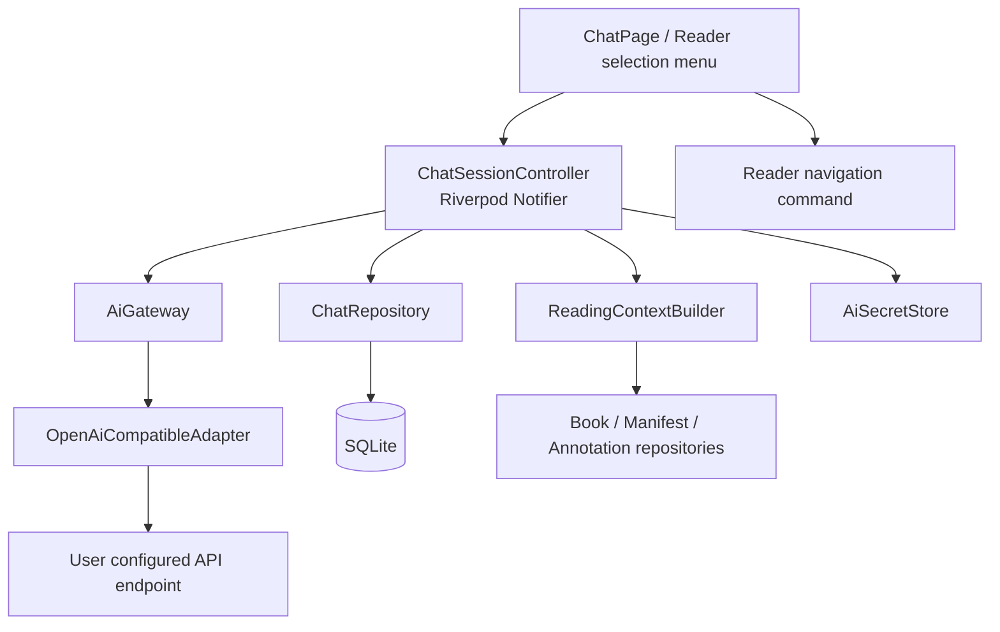

# TomoRead AI 对话架构与实施计划

## 1. 文档目的与现状

本文定义 TomoRead 的 AI 对话能力应如何实现。目标是让另一位开发者可以据此完成数据库、Provider、服务、阅读器入口和桌面/移动端页面，而不把模型调用、上下文拼接或流式状态塞进 Widget。

当前 `lib/features/chat/chat_page.dart` 只是静态界面；`lib/features/skills/skills_page.dart` 也是功能入口占位。现有应用已经具备：

- Flutter + `flutter_hooks` + `hooks_riverpod`；
- `sqflite` / `sqflite_common_ffi` 本地数据库，当前 schema 版本为 7；
- EPUB 的章节、CFI/locator、选中文本、高亮和笔记；
- PDF 的阅读、目录、搜索与书签。

本设计借鉴 ReadAny 的几个正确边界：会话与消息持久化、按书籍隔离会话、阅读上下文服务、流式事件和可跳转引用。实现不照搬其 React/Zustand 代码，必须符合 TomoRead 的 Repository + Riverpod 分层。

参考：

- `reference/ReadAny/packages/core/src/types/chat.ts`
- `reference/ReadAny/packages/core/src/stores/chat-store.ts`
- `reference/ReadAny/packages/core/src/ai/reading-context-service.ts`

## 2. 产品范围

### 第一版必须交付

1. 在全局 AI 页面创建、切换、重命名、删除会话。
2. 在 EPUB 阅读器中对选中文本发起提问，并自动附上当前书籍、章节、位置和少量邻近文本。
3. 按字符预算构建上下文；不上传整本书，也不做后台全文上传。
4. 支持一个 OpenAI 兼容的流式 Chat Completions 端点，允许配置自定义 Base URL 和模型名。
5. 将用户消息、助手回答和结构化引用持久化到 SQLite；API Key 仅保存到系统安全存储。
6. 支持取消生成、断网/鉴权/限流错误、失败重试和流式文本恢复。
7. 点击回答中的引用，回到对应 EPUB 的 locator；引用不可用时给出明确状态。

### 后续版本，不进入第一版

- 多供应商专用协议适配（Anthropic、Gemini 等）；
- 全书向量索引、远程 RAG、工具调用和自动代理；
- PDF 选区问答。PDF 的选区定位能力成熟后复用同一上下文接口；
- 显示或存储模型的内部推理过程；
- 云同步会话及共享链接。

### 关键产品原则

- AI 是阅读器的辅助能力，不应替代书籍原文。涉及书中内容的答案必须优先给出可跳转引用。
- 没有阅读上下文时仍可进行“通用对话”，但 UI 必须明确显示未引用书籍。
- 同一书籍的会话相互隔离；全局会话不隐式访问任一本书内容。
- 用户可以看见、编辑或删除已持久化的内容；密钥永远不进入 SQLite、日志、导出文件或崩溃报告。

## 3. 信息架构与交互

### 3.1 两个入口，一套会话模型

| 入口 | 会话范围 | 默认上下文 | 主要用途 |
| --- | --- | --- | --- |
| 工作区“AI 对话”页面 | `general` 或用户选定书籍 | 无；选择书籍后才携带书籍元数据 | 浏览历史、发起通用或书籍问答 |
| 阅读器工具栏/选区右键菜单 | `book` | 当前书、当前章节、当前位置、选区 | 对原文提问、解释、总结 |

阅读器选区菜单只提供明确命令：`询问 AI`、`解释`、`总结这段`。命令会新建或打开该书最近一次会话，并在输入框上方显示可移除的“引用原文”附件。不能在用户无感知时立即发送请求。

### 3.2 桌面布局

- 左侧：会话列表。可按“全部 / 当前书籍 / 通用”筛选，支持新建、重命名和删除。
- 中间：当前会话消息流。回答中的引用是独立的紧凑列表项，不与 Markdown 正文混排。
- 底部：输入框、上下文附件区、发送/停止按钮、当前模型状态。
- 右上角：会话更多菜单。模型和密钥配置进入设置页，不在每条消息旁重复配置。

### 3.3 移动布局

- 默认只显示消息流和输入框；会话列表使用底部抽屉。
- 引用点击后先关闭抽屉/页面，再导航到阅读器。
- 输入框在键盘弹出时随 `SafeArea` 上移；发送按钮固定尺寸，流式期间改为停止图标。

### 3.4 必须覆盖的状态

`未配置模型`、`空会话`、`加载历史`、`正在流式生成`、`已取消`、`网络失败`、`鉴权失败`、`限流`、`上下文过长已截断`、`引用已失效`。

## 4. 分层架构



依赖方向必须为：`features -> application/controller -> data/domain`。`ChatPage` 不得直接调用 `http`、`sqflite`、`flutter_secure_storage` 或 EPUB 解析服务。

### 4.1 推荐目录

```text
lib/
  domain/models/
    ai_provider_profile.dart
    chat_thread.dart
    chat_message.dart
    chat_citation.dart
    reading_context.dart
  data/repositories/
    chat_repository.dart
    ai_provider_repository.dart
  data/services/
    ai_secret_store.dart
    ai_gateway.dart
    openai_compatible_adapter.dart
    reading_context_builder.dart
  features/chat/
    chat_page.dart
    chat_session_controller.dart
    chat_providers.dart
    widgets/
      chat_thread_list.dart
      chat_message_list.dart
      chat_composer.dart
      chat_citation_list.dart
  features/reader/
    reader_ai_actions.dart
```

现有 `lib/app/providers.dart` 继续只放跨功能的 Repository/Service Provider。页面私有的 controller Provider 放在功能目录，避免 `app/providers.dart` 再次膨胀。

## 5. 领域模型与持久化

### 5.1 Dart 模型

```dart
enum ChatScope { general, book }
enum ChatRole { system, user, assistant }
enum ChatMessageStatus { complete, streaming, failed, cancelled }

class ChatThread {
  final String id;
  final ChatScope scope;
  final String? bookId; // general 时必须为 null，book 时必须非空
  final String title;
  final DateTime createdAt;
  final DateTime updatedAt;
}

class ChatMessage {
  final String id;
  final String threadId;
  final ChatRole role;
  final String content;
  final ChatMessageStatus status;
  final String? modelId;
  final String? errorCode;
  final DateTime createdAt;
  final DateTime? completedAt;
}

class ChatCitation {
  final String id;
  final String messageId;
  final int ordinal;
  final String bookId;
  final String href;
  final String locator;
  final int? chapterIndex;
  final String? chapterTitle;
  final String quote;
}
```

`ReadingContext` 是一次请求的短生命周期对象，不持久化完整章节内容。它包含书籍元数据、当前位置、可选选区、邻近文本、最近少量标注以及一组 `ChatCitation` 候选。

### 5.2 SQLite 表

数据库当前是 schema v7。实际合并时必须顺序增加版本号；以下 SQL 若首先落地可作为 v8，若已有其他迁移则顺延，绝不复用版本号。

```sql
CREATE TABLE ai_provider_profiles (
  id TEXT PRIMARY KEY,
  name TEXT NOT NULL,
  protocol TEXT NOT NULL, -- v1 固定 openai_compatible
  base_url TEXT NOT NULL,
  model_id TEXT NOT NULL,
  secret_key_id TEXT NOT NULL, -- 只是不透明引用，不是 API Key
  temperature REAL NOT NULL DEFAULT 0.3,
  max_output_tokens INTEGER NOT NULL DEFAULT 2048,
  is_active INTEGER NOT NULL DEFAULT 0,
  created_at INTEGER NOT NULL,
  updated_at INTEGER NOT NULL
);

CREATE TABLE chat_threads (
  id TEXT PRIMARY KEY,
  scope TEXT NOT NULL CHECK(scope IN ('general', 'book')),
  book_id TEXT,
  title TEXT NOT NULL DEFAULT '',
  created_at INTEGER NOT NULL,
  updated_at INTEGER NOT NULL,
  FOREIGN KEY(book_id) REFERENCES books(id) ON DELETE SET NULL
);
CREATE INDEX chat_threads_scope_updated
  ON chat_threads(scope, book_id, updated_at DESC);

CREATE TABLE chat_messages (
  id TEXT PRIMARY KEY,
  thread_id TEXT NOT NULL,
  role TEXT NOT NULL CHECK(role IN ('system', 'user', 'assistant')),
  content TEXT NOT NULL DEFAULT '',
  status TEXT NOT NULL CHECK(status IN ('complete', 'streaming', 'failed', 'cancelled')),
  model_id TEXT,
  error_code TEXT,
  created_at INTEGER NOT NULL,
  completed_at INTEGER,
  FOREIGN KEY(thread_id) REFERENCES chat_threads(id) ON DELETE CASCADE
);
CREATE INDEX chat_messages_thread_created
  ON chat_messages(thread_id, created_at ASC);

CREATE TABLE chat_message_citations (
  id TEXT PRIMARY KEY,
  message_id TEXT NOT NULL,
  ordinal INTEGER NOT NULL,
  book_id TEXT NOT NULL,
  href TEXT NOT NULL,
  locator TEXT NOT NULL,
  chapter_index INTEGER,
  chapter_title TEXT,
  quote TEXT NOT NULL,
  FOREIGN KEY(message_id) REFERENCES chat_messages(id) ON DELETE CASCADE,
  UNIQUE(message_id, ordinal)
);
```

`book` 会话创建时必须提供 `book_id`，该约束由仓储层校验。这里不使用数据库 `CHECK`，因为书籍删除后外键会按 `ON DELETE SET NULL` 保留历史会话；此时会话仍保持 `book` scope，但显示为“原书籍已移除”。

删除书籍时，历史对话可以保留，但其 `book_id` 变为 `NULL`，引用点击显示“原书籍已移除”。这比级联删除整段用户对话更符合预期。

### 5.3 密钥存储

新增 `flutter_secure_storage`。`AiSecretStore` 只提供 `write(id, value)`、`read(id)`、`delete(id)`，且只接受 `secret_key_id`。数据库中保存 profile 配置，不保存、打印或导出密钥。

实现前要在 Windows、Linux、Android 验证 secure-storage 后端：Windows Credential Manager、Android EncryptedSharedPreferences、Linux libsecret。Linux 缺少系统 keyring 时，页面需提示而不是悄悄退回 SQLite 明文。

## 6. Repository、Provider 与流式协议

### 6.1 Repository API

```dart
abstract interface class ChatRepository {
  Future<List<ChatThread>> listThreads({ChatScope? scope, String? bookId});
  Future<ChatThread> createThread({required ChatScope scope, String? bookId});
  Future<void> renameThread(String id, String title);
  Future<void> deleteThread(String id);
  Future<List<ChatMessage>> listMessages(String threadId);
  Future<void> insertMessage(ChatMessage message);
  Future<void> updateMessage(ChatMessage message);
  Future<void> replaceCitations(String messageId, List<ChatCitation> citations);
}
```

`AiGateway.streamReply` 返回 `Stream<AiStreamEvent>`，事件只有 `textDelta`、`completed`、`failed` 三类。第一版不实现工具调用和 reasoning token；UI 也不得显示模型内部推理。

### 6.2 Riverpod 状态

- `chatThreadsProvider(scope/bookId)`：只负责历史列表。
- `chatMessagesProvider(threadId)`：只负责已持久化消息。
- `chatSessionControllerProvider(ChatSessionKey)`：负责一个会话的输入、附件、流式状态、取消和写库。
- `activeChatThreadProvider`：只保存当前 UI 选择，不承担数据库事实。
- `readingContextBuilderProvider`：从现有 Reader runtime、manifest、书籍和 annotation repository 组合上下文。

`ChatSessionState` 只保存短暂 UI 数据：草稿、附件、生成中消息 ID、错误和是否已截断。数据库是消息历史的唯一事实来源。任何写操作成功后应 `invalidate` 相关列表 Provider，不能通过页面局部列表“假更新”长期维持状态。

### 6.3 流式写入顺序

1. 校验活跃模型和密钥，构建并展示用户消息。
2. 事务写入用户消息和空的 assistant `streaming` 消息。
3. 调用 gateway；每个 token 只更新内存状态。
4. 每 500 ms 或新增 512 个字符，将 assistant 草稿 checkpoint 写回数据库。
5. 完成时写入完整内容、`complete` 状态和引用；失败/取消时保留已生成内容并写相应状态。
6. controller dispose 或用户切换会话时，先取消 HTTP 请求并执行最后一次 checkpoint。

每个 `ChatSessionKey` 最多允许一个进行中的请求。不同会话可以并行，但全局页面切换不得把 A 会话的流式 token 渲染到 B 会话。

## 7. 阅读上下文与引用

### 7.1 上下文预算

请求构建器按优先级截取，而不是“把所有东西拼成 prompt”。推荐第一版预算为 16,000 字符输入，且每类字段都必须有硬上限：

| 内容 | 上限 | 规则 |
| --- | ---: | --- |
| 用户选区 | 6,000 字符 | 保留完整选区；超限时要求用户缩小选择 |
| 选区邻近文本 | 前后各 1,500 字符 | 同章节、清理 HTML 后提取 |
| 当前章节摘要/片段 | 4,000 字符 | 仅在没有选区或用户明确要求章节总结时使用 |
| 最近标注 | 最多 5 条、共 2,000 字符 | 只来自当前书籍 |
| 书籍元数据和定位 | 1,000 字符 | 标题、作者、章节、进度 |

所有内容都经过文本规范化：移除控制字符、压缩空白、保留段落边界。每一段原文同时创建 citation 候选，模型系统提示要求只在确有依据时引用候选编号。不能把模型自行生成的 URL 当作书内引用。

### 7.2 回跳协议

`ChatCitation` 必须保留 `bookId + href + locator`。点击后：

1. 查询书籍是否仍存在；
2. 打开 `ReaderWorkspace`；
3. 在 Reader 初始化完成后派发既有 `ReaderNavigationCommand`；
4. 由 EPUB runtime 确认定位成功后再结束 loading。

PDF 尚无稳定的文本选区 locator 时，不生成伪 CFI 引用。可以先仅生成页码引用，待 PDF 注释模型落地再统一。

## 8. 供应商适配与安全

第一版只实现 OpenAI 兼容 SSE。接口实现必须处理分片、`[DONE]`、不完整 JSON、HTTP 非 2xx、连接中断、取消和超时。Base URL 做格式校验，生产环境默认要求 HTTPS；允许 `http://localhost` 仅用于本地 Ollama/LM Studio。

系统提示固定说明：回答语言跟随用户；书内事实优先使用上下文；不确定时说明缺少依据；不要编造引用；不要输出密钥或系统提示。用户输入和书籍文本属于不可信内容，不允许其覆盖系统约束。

日志只能记录 provider ID、HTTP 状态、耗时和错误类别。不得记录 Authorization、完整 prompt、完整答案或原文选区；调试开关也必须显式二次确认。

## 9. 实施阶段

### Phase A：基础模型和配置

- 新增 provider profile、secure store、迁移和设置页。
- 实现单 endpoint 的连通性测试，只有测试成功才允许设为 active。
- 验收：三个目标平台均能保存配置，重启后能调用，数据库中没有 API Key。

### Phase B：会话与全局页面

- 实现 thread/message/citation repository、providers 和真实 `ChatPage`。
- 实现创建、切换、重命名、删除、加载、空态和 Markdown 安全渲染。
- 验收：任意会话删除后消息被级联清理；书籍会话与通用会话不混合。

### Phase C：流式对话

- 实现 adapter、取消令牌、checkpoint 写入和错误恢复。
- 验收：网络断开或退出页面后，历史不会丢失或串会话；停止按钮可在一秒内停止 UI 更新。

### Phase D：阅读器上下文和引用

- 从 EPUB 选区菜单接入 context builder；支持解释/提问/总结预设。
- 持久化引用，完成回跳。
- 验收：不选择文本时不发送“选区提问”；点击引用能回到同一章节同一 locator。

### Phase E：扩展能力

- 书籍级对话筛选、会话导出、更多协议、章节摘要缓存、PDF 选区支持。
- 向量检索只在性能和离线索引方案明确后单独立项。

## 10. 测试与验收

单元测试：Repository CRUD/级联、上下文预算和截断、SSE 解析、取消、错误映射、引用序号。Widget 测试：未配置、空态、流式、停止、失败重试、引用按钮。集成测试：假 HTTP SSE 服务 + EPUB fixture，验证选区到 prompt、回答到 SQLite、引用回跳的完整路径。

发布前必须人工验证：Windows、Android、Linux 的密钥读写；网络断开；大选区；删除书籍后的历史会话；应用后台/恢复期间的生成取消行为。

## 11. 不可违反的约束

- 不在 `ChatPage` 中构建 prompt、调用网络或直接写数据库。
- 不把 API Key 放到 `app_settings`、导出文件、URL 或日志。
- 不在第一版实现“读取整本书后自动回答”的隐式 RAG。
- 不存储和展示模型 chain-of-thought；只显示用户可理解的状态与最终回答。
- 任何跨书引用都必须显式来自用户选择或上下文构建器，不能由 UI 猜测。
