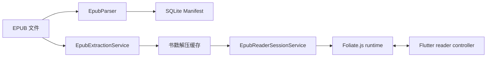
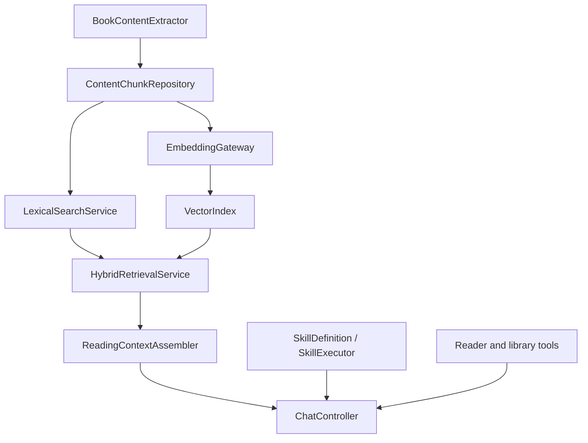

# TomoRead 与 ReadAny / Lumina 功能差距分析

> 更新日期：2026-08-02  
> 分析对象：当前工作区中的 TomoRead、`reference/ReadAny`、`reference/lumina-main`

## 1. 文档目的

本文基于三个项目的实际源码、依赖、数据库和页面入口，对 TomoRead 当前能力进行盘点，并给出后续开发顺序。分析不以 README 的宣传文案为唯一依据；README 与源码不一致时，以源码中可找到的实现为准。

本文解决四个问题：

1. TomoRead 已经具备什么，不应重复开发什么；
2. 与 ReadAny、Lumina 相比，真正影响产品完整度的差距是什么；
3. 哪些参考实现适合 TomoRead，哪些只应参考交互而不应照搬；
4. 后续模块、数据表和里程碑应按什么依赖关系落地。

状态定义：

| 状态 | 含义 |
| --- | --- |
| 完整 | 已有真实数据、可操作页面和持久化闭环 |
| 部分 | 已有主流程，但交互深度、平台覆盖或可靠性仍不足 |
| 缺失 | 源码中没有可用实现，或只有静态占位 |
| 不适用 | 不是该项目的产品范围，不能据此判断实现质量 |

## 2. 核心结论

TomoRead 已经不是单纯的阅读器界面壳。它目前具备本地 EPUB/PDF 书库、书籍详情、分页/滚动阅读、书签和标注、全局笔记、阅读统计，以及可持久化的基础 AI 对话。相较 Lumina，TomoRead 在 PDF、标注、知识整理、统计和 AI 上已经领先；相较 ReadAny，核心差距集中在以下六个方向：

1. **AI 检索深度**：没有全文分块、关键词/语义检索、RAG、工具调用、长期记忆和可执行技能；
2. **数据可迁移性**：没有整库备份、原子恢复、配置迁移和缓存管理；
3. **跨设备能力**：没有 WebDAV/S3/LAN 同步、软删除、墓碑和冲突策略；
4. **移动端成熟度**：Android 仍是实验性平台，文件接入、性能、硬件按键和阅读细节不够完整；
5. **辅助阅读能力**：没有 TTS、翻译、导入字体、脚注浮层和图片查看器；
6. **平台与格式广度**：没有 macOS/iOS 正式支持，也没有 MOBI/AZW/FB2/CBZ/TXT/UMD 等格式。

最合理的产品方向不是复制 ReadAny 的所有功能，而是：

- 保留 TomoRead 的 Flutter、Riverpod、SQLite 和 Repository 分层；
- 以 ReadAny 的 RAG、AI Agent、同步和统计深度作为中长期标杆；
- 以 Lumina 的移动 EPUB 交互、文件接入、备份恢复和自定义字体作为近期标杆；
- 在阅读器正确性、备份和 Android 性能稳定之前，不继续扩张格式数量。

## 3. 三个项目的技术定位

| 项目 | 技术栈 | 主要平台 | 阅读资源策略 | 数据层 | 产品重心 |
| --- | --- | --- | --- | --- | --- |
| TomoRead | Flutter、Hooks Riverpod、Foliate.js、`pdfrx` | Windows/Linux；Android 实验性 | EPUB 解压缓存后由 WebView 按资源加载；PDF 原生插件渲染 | SQLite，schema v10 | 本地阅读、标注、知识整理、基础 AI |
| ReadAny | React/Tauri + Expo、Foliate.js/PDF.js、LangChain/LangGraph | Windows/Linux/macOS/iOS/Android | 桌面 EPUB 使用 ZIP 按条目读取；移动端使用本地文件服务和阅读器桥接 | SQLite/平台适配层 + 向量索引 | AI 原生阅读、RAG、同步、TTS、多格式 |
| Lumina | Flutter、Riverpod、Isar、InAppWebView | Android/iOS | Rust FFI 保持 EPUB 压缩并按请求从 ZIP 读取 | Isar | 轻量移动 EPUB 阅读体验 |

TomoRead 当前数据库已经承载书籍、书籍阅读覆盖设置、书签、Manifest、标注及标签、AI Provider、对话、引用和阅读会话。继续使用 SQLite 比迁移到 Isar 更合理：现有全局笔记、统计、对话和后续同步都需要关系查询、事务和明确迁移，迁移数据库不会直接补齐任何产品差距。

## 4. 总体功能矩阵

| 领域 | TomoRead | ReadAny | Lumina | TomoRead 判断 |
| --- | --- | --- | --- | --- |
| EPUB 导入与托管 | 完整 | 完整 | 完整 | 已有哈希去重和托管存储 |
| PDF 导入与阅读 | 完整 | 完整 | 不适用 | TomoRead 已有目录、缩略图、搜索、书签和进度 |
| 多格式导入 | 缺失 | 完整 | 缺失 | 仅支持 EPUB/PDF |
| 书籍详情与元数据编辑 | 完整 | 完整 | 完整 | 核心闭环已具备 |
| 书库搜索、筛选、批量管理 | 完整 | 完整 | 部分 | TomoRead 已有网格/列表、分类、标签、收藏和批量操作 |
| 文件夹导入、拖放、系统分享/文件关联 | 缺失 | 部分 | 完整 | ReadAny 可确认桌面拖放；Lumina 明确支持 SAF 目录和系统分享入口 |
| EPUB 分页/滚动、单双栏 | 完整但需加固 | 完整 | 完整 | TomoRead 近期出现过分页、进度和滚动回归，需测试资产化 |
| RTL/竖排 | 部分 | 完整 | 完整 | 运行时已有支持，但缺少系统性兼容测试 |
| 脚注、图片、链接处理 | 部分 | 完整 | 完整 | 内部链接已有；缺脚注浮层、图片查看器、外链策略 |
| 自定义字体文件 | 缺失 | 完整 | 完整 | 目前只有预置字体选项 |
| 书签、高亮、注释 | 完整 | 完整 | 缺失 | TomoRead 是明确优势 |
| PDF 文本标注与 AI 选区 | 缺失 | 部分或完整 | 不适用 | PDF 当前只覆盖阅读、搜索和书签 |
| 全局笔记 | 完整 | 完整 | 缺失 | TomoRead 已有搜索、筛选、编辑和回跳 |
| 笔记/知识导出 | 部分 | 完整 | 缺失 | TomoRead 仅 Markdown/JSON；缺 Obsidian/Notion/整库知识导出 |
| 基础 AI 对话 | 完整 | 完整 | 缺失 | TomoRead 支持流式、取消、引用和安全密钥 |
| RAG/语义搜索 | 缺失 | 完整 | 缺失 | 最大战略差距之一 |
| AI 工具与技能系统 | 缺失 | 完整 | 缺失 | `SkillsPage` 当前只有静态卡片 |
| 多供应商专用适配 | 部分 | 完整 | 缺失 | 目前只有 OpenAI 兼容 Chat Completions |
| TTS | 缺失 | 完整 | 缺失 | ReadAny 有系统、Edge、云端播放器抽象 |
| 翻译 | 缺失 | 完整 | 计划中 | ReadAny 有选区和章节翻译及缓存 |
| 阅读统计 | 完整基础版 | 完整增强版 | 缺失 | 缺目标、徽章、热力图、ETA 和分享报告 |
| 完整备份/恢复 | 缺失 | 部分 | 完整 | Lumina 是更直接的 Flutter 参考 |
| WebDAV/S3/LAN 同步 | 缺失 | 完整 | 计划中 | 需先补软删除、墓碑和冲突契约 |
| 国际化 | 缺失 | 完整 | 完整 | TomoRead 当前界面文案直接写中文 |
| 引导、更新、反馈 | 缺失 | 完整 | 部分或完整 | 设置页目前只有外观和默认阅读 |
| 桌面端成熟度 | 主要目标 | 完整 | 不适用 | TomoRead 应继续保持优势 |
| 移动端成熟度 | 部分 | 完整 | 主要目标 | Android 需要性能和交互专项治理 |

## 5. 分领域差距

### 5.1 书库、导入与数据管理

TomoRead 已完成：

- EPUB/PDF 多选导入；
- 流式复制并计算 SHA-256，按哈希去重；
- 书籍、封面和 Manifest 托管存储；
- 书库搜索、格式筛选、分类、标签、收藏和批量操作；
- 书籍详情、封面展示、作者/标题/简介等元数据编辑；
- 继续阅读和阅读位置保存。

与 ReadAny 的差距：

- ReadAny 实际支持 EPUB、PDF、MOBI、AZW、AZW3、FB2、FBZ、CBZ、TXT、UMD；TXT 和 UMD 会先转换为 EPUB；
- 桌面端支持拖放，并有 WebDAV 远程导入；当前源码未确认本地文件夹扫描导入；
- 有评分、书评、更完整的分组模型及软删除字段；
- 有配置迁移、远程书籍按需下载和 EPUB 草稿编辑/校验/导出工作区。

与 Lumina 的差距：

- 支持 Android SAF 文件夹导入、iOS 分享入口和文件 URI/content URI 接入；
- 有完整书库备份、恢复进度、缓存清理和孤立文件清理；
- 保存全部作者、subjects、完成状态和分组信息；
- 支持导入本地字体文件。

建议：

1. 先实现**整库备份/恢复、缓存清理、拖放/文件关联**，再扩展格式；
2. 备份必须包含数据库、书籍、封面、Manifest 和版本化清单，并使用临时目录验证后原子替换；
3. 多格式应通过 `BookFormatAdapter` 扩展，而不是在 `BookImportService` 中继续增加 `switch` 分支；
4. ReadAny 的 EPUB 编辑工作区属于编辑/出版能力，暂列 P3，不应阻塞阅读器主线。

### 5.2 EPUB 解析、资源加载和渲染

TomoRead 当前路径：



现有能力包括分页/滚动、单栏/双栏、滚轮和按钮翻页、内部链接、搜索、文本选择、标注、书签、进度和 locator 回跳。Foliate paginator 中也存在 RTL 和竖排处理。

关键差距不是“是否使用 WebView”，而是阅读契约和边缘交互：

| 能力 | TomoRead | ReadAny | Lumina | 建议 |
| --- | --- | --- | --- | --- |
| ZIP 资源读取 | 整书解压并缓存 | ZIP 条目按需读取 | Rust FFI 按请求读取 | 近期保留解压缓存，先优化复用和清理 |
| 脚注 | 普通链接行为 | 有专门交互 | 浮层显示 | 增加 noteref 检测和脚注浮层 |
| 图片查看 | 随正文显示 | 有阅读器处理 | 长按大图 | 增加图片点击/长按查看器和保存策略 |
| 外部链接 | 缺少明确策略 | 有受控处理 | 询问/始终/禁止 | 增加协议白名单和用户策略 |
| 自定义字体 | 预置字体 | 支持导入 | 支持导入并覆盖 EPUB 字体 | 增加字体仓库和注入协议 |
| 音量键翻页 | 缺失 | 移动端支持 | 支持 | 仅 Android/iOS 启用 |
| 保持亮屏 | 缺失 | 阅读/TTS 场景处理 | `wakelock_plus` | 增加会话级 wake lock |
| 复杂书籍回归集 | 不完整 | 有较多阅读器逻辑与测试 | 有移动端专项处理 | 建立固定 EPUB 样本和桥接契约测试 |

不建议近期照搬 Lumina 的 Rust stream-from-ZIP。它会引入 Rust 工具链、FFI、各平台原生构建和新的崩溃边界，与项目“避免 Rust”的约束冲突。若解压缓存实测成为瓶颈，可按以下顺序优化：

1. 每本书只解压一次，使用内容哈希和解析器版本校验缓存；
2. 加入缓存大小、最近使用时间和安全清理；
3. Android 导入阶段放到 isolate，避免主线程散列和解压；
4. 必要时实现纯 Dart 的资源服务器/懒解压适配器，但先以性能数据证明收益。

### 5.3 阅读定位和可靠性

TomoRead 最近的分页、滚动、目录、书签、注释跳转和进度问题说明：实现已经足够复杂，但缺少稳定的跨层契约。继续增加动效或格式之前，应把以下行为变成自动测试：

- 章节索引、章节内 ratio、CFI/anchor 和全书 progress 的单向换算；
- 单栏、双栏、窗口缩放后页数重新计算和当前位置保持；
- 滚动模式只使用连续滚动位置，不复用分页页码；
- 拖动进度条期间显示草稿值，松开后只接受目标位置对应的新位置事件；
- 目录、书签、注释和 AI 引用统一通过 `ReaderNavigationCommand`；
- WebView 重建、应用重启和布局变化后 locator 可恢复；
- 无关的 ResizeObserver、Range、无障碍树告警不能被当作致命初始化失败；
- Android 与 Windows 使用同一组桥接事件 schema 和容错规则。

推荐建立 `test/fixtures/epub/` 回归集，至少覆盖 EPUB2、EPUB3、长章节、短章节、图片章节、脚注、内部锚点、RTL、竖排、固定布局、破损资源和超大章节。受版权限制，样本应使用自建或明确可再分发内容。

### 5.4 PDF

TomoRead 的 PDF 能力比表面上完整：`pdfrx` 工作区已有目录、缩略图、全文搜索匹配、页码跳转、书签、阅读位置和底部进度控制。这部分不需要改用 ReadAny 的 PDF.js。

主要缺口：

- PDF 文本选择、高亮、注释和统一的 locator；
- PDF 选区询问 AI、引用回跳和全文分块；
- 页面裁边、单双页、连续/单页等阅读布局设置；
- 密码 PDF、损坏 PDF 和大文件的明确错误状态；
- ReadAny 路线图中的 PDF 重排也尚未完成，不应作为近期必追目标。

建议先定义 `DocumentLocator` 的格式无关接口，再实现 PDF 标注。不要把 EPUB CFI 强行复用于 PDF，PDF 可以使用 `page + normalized rectangles + text quote` 的复合定位。

### 5.5 标注、笔记与知识库

TomoRead 已有真实优势：书内多书签、文本高亮、颜色标注、Markdown 笔记、标签、全局筛选、自动保存、原文回跳，以及 Markdown/JSON 导出。

与 ReadAny 相比仍缺：

- PDF 标注统一进入全局笔记；
- Obsidian、Notion 和整库知识导出；
- 对话导出；
- 富文本编辑工具栏和更丰富的知识组织；
- 全文索引、语义搜索、跨书主题聚合；
- 同步所需的软删除、版本和冲突信息。

近期应优先增加**整库知识导出**和 PDF 标注，不必立即引入富文本编辑器。Markdown 作为存储格式更容易同步、导出和做 AI 上下文。

### 5.6 AI 对话、RAG 和技能

TomoRead 当前 AI 是可用的第一版：

- OpenAI 兼容 Chat Completions + SSE；
- Provider、模型、Base URL 和安全 API Key；
- 全局/按书会话、消息持久化、取消、错误处理；
- 选中文本的询问、解释、总结；
- 结构化引用和原文回跳。

它与 ReadAny 的主要差距不是聊天 UI，而是模型调用前后的知识管线：

| 层级 | TomoRead | ReadAny |
| --- | --- | --- |
| 上下文 | 当前选区和显式附件 | 当前页/章、标注、书库、检索结果的统一上下文服务 |
| 检索 | 无 | 分块、倒排/BM25、向量、混合检索、RAG 工具 |
| Embedding | 无 | 本地和远程 embedding，可配置模型与向量化任务 |
| Agent | 单次流式回复 | LangGraph 工具循环、超时、去重、工具结果和引用事件 |
| 记忆 | 完整历史直接发送 | 滚动摘要/长期记忆，控制上下文预算 |
| 技能 | 静态占位卡 | 内置技能、自定义技能、执行器和工具 |
| Provider | OpenAI 兼容 | OpenAI、Anthropic、Gemini、DeepSeek 等专用适配 |
| 输出 | Markdown 和引用 | 工具结果、思维导图、引用、导出等结构化 part |

推荐按由底向上的顺序实现，不直接引入 LangChain：



第一阶段先做可测试的章节分块和关键词检索，再增加 embedding。这样即使用户不配置 embedding，书内搜索和引用仍可工作。技能页在执行链完成前应显示“尚未启用”或隐藏入口，不能保留看似可点击但无行为的卡片。

### 5.7 TTS 与翻译

ReadAny 的 TTS 已形成引擎、声音分组、播放游标、重新朗读、播放器和休眠定时器等完整抽象，桌面和移动端都有 UI。翻译则包含 Provider、选区翻译、章节翻译和缓存。

TomoRead 当前两项均缺失。建议边界：

```dart
abstract interface class TtsEngine {
  Future<List<TtsVoice>> listVoices();
  Stream<TtsPlaybackEvent> speak(TtsRequest request);
  Future<void> pause();
  Future<void> resume();
  Future<void> stop();
}

abstract interface class TranslationGateway {
  Future<TranslationResult> translate(TranslationRequest request);
}
```

实现顺序：先系统 TTS，再可选云 TTS；先选区翻译，再章节翻译与缓存。TTS 必须消费阅读器提供的结构化可见文本和 locator，不能自行抓取 WebView DOM，否则分页切换后难以保持朗读游标。

### 5.8 阅读统计

TomoRead 已实现有效前台阅读活动、日/周/月/年/全部报告、阅读时长、活跃天数、连续阅读、趋势和热门书籍。这一基础已经完整。

ReadAny 增强项包括：

- 阅读目标和目标进度；
- 徽章；
- 月度/全年热力图；
- 完成 ETA、更多 lifetime facts；
- 更丰富的统计卡片和报告展示。

建议下一步先补阅读目标和热力图。徽章属于激励层，必须依赖稳定统计口径；分享图和年度报告属于展示层，优先级更低。

### 5.9 备份、同步与冲突

Lumina 已实现本地整库导出/导入、恢复进度和存储清理，但 WebDAV 仍在计划中。ReadAny 已实现 WebDAV、S3、LAN 三种 backend，并包含设备快照、墓碑、旧删除保护、书籍文件同步和按需下载。

TomoRead 不能直接在现有表上增加“上传数据库文件”按钮。同步前至少需要：

- 所有同步实体使用稳定 ID；
- `created_at`、`updated_at` 使用统一 UTC 时间；
- 删除改为软删除或写入墓碑；
- 明确每种实体的合并策略；
- 书籍二进制与数据库记录分开同步；
- 密钥和同步凭据只进入安全存储；
- 导入/恢复/同步均可失败回滚。

推荐接口：

```dart
abstract interface class SyncBackend {
  Future<void> testConnection();
  Future<List<RemoteEntry>> list(String path);
  Future<Stream<List<int>>> download(String path);
  Future<void> upload(String path, Stream<List<int>> bytes);
  Future<void> delete(String path);
}

abstract interface class BackupService {
  Future<void> exportLibrary(BackupExportRequest request);
  Future<BackupInspection> inspect(String archivePath);
  Future<void> restore(BackupRestoreRequest request);
}
```

先完成本地备份/恢复，再做 WebDAV；S3 和 LAN 只在 WebDAV 的数据合并协议稳定后增加。同步 backend 可以复用传输接口，但本地备份不能依赖网络同步实现。

### 5.10 移动端、平台能力和设置

TomoRead 的响应式页面和 Android WebView 已存在，但 Android 仍出现过启动卡顿、插件初始化和阅读器空白等问题。ReadAny 和 Lumina 都为移动端设计了独立的信息层级，不是简单缩窄桌面布局。

移动端差距：

- 系统分享、文件关联和目录授权导入；
- 音量键翻页、保持亮屏、返回手势和安全区专项；
- 脚注、图片、链接等移动阅读交互；
- 导入/解析/解压的 isolate 化和冷启动性能预算；
- Android 真机回归测试；
- iOS 平台工程和发布流程。

通用设置差距：

- 设置页目前只有应用外观和默认阅读；
- 缺字体管理、AI Provider 独立管理、备份、同步、TTS、翻译、存储、缓存、更新、关于和诊断；
- 缺国际化，ReadAny 有多语言资源，Lumina 使用 Flutter `l10n`；
- 缺首次引导和版本更新检查。

设置页应按领域拆分路由/子页面，不能继续把全部配置塞进现有 `settings_page.dart`。

## 6. 推荐数据与模块扩展

### 6.1 数据表

以下表按功能阶段新增，不要求一次完成：

| 表 | 用途 | 依赖阶段 |
| --- | --- | --- |
| `content_chunks` | 保存章节分块、文本哈希、href、locator 范围和顺序 | RAG 基础 |
| `content_index_jobs` | 保存提取/索引状态、解析器版本和错误 | RAG 基础 |
| `content_embeddings` | 保存模型维度、向量或外部索引引用 | 语义检索 |
| `reading_goals` | 日/周时长或阅读天数目标 | 统计增强 |
| `sync_tombstones` | 保存删除实体、时间和设备 | 同步基础 |
| `sync_state` | 保存设备 ID、游标和上次同步摘要 | 同步基础 |
| `translation_cache` | 按内容哈希、源/目标语言缓存章节翻译 | 章节翻译 |
| `imported_fonts` | 保存字体元数据、文件路径和哈希 | 字体管理 |

不要把 embedding、翻译结果或同步状态塞进 `books.tags_json`、`app_settings` 等通用字段。结构化业务数据应有明确表和迁移。

### 6.2 推荐目录边界

```text
lib/
  domain/
    models/
      content_chunk.dart
      document_locator.dart
      reading_goal.dart
      sync_models.dart
    ports/
      book_content_extractor.dart
      embedding_gateway.dart
      sync_backend.dart
      tts_engine.dart
      translation_gateway.dart
  data/
    repositories/
      content_index_repository.dart
      sync_repository.dart
      reading_goal_repository.dart
    services/
      backup/
      indexing/
      retrieval/
      sync/
      tts/
      translation/
  features/
    backup/
    search/
    sync/
    tts/
    translation/
```

保持现有分层规则：Widget 只渲染和发出意图；Riverpod Controller 管理用例状态；Repository 负责持久化；Service/Gateway 负责外部协议、解析和计算。耗时的 EPUB 提取、分块、embedding、备份压缩和恢复校验不能运行在 UI isolate 的同步调用中。

## 7. 优先级路线图

### P0：阅读可信度和数据安全

1. 建立 EPUB 定位、分页、滚动、目录/书签/注释跳转的回归样本和桥接测试；
2. 建立 Android 冷启动、导入和打开阅读器的性能基线，将散列/解析/解压移出 UI isolate；
3. 实现完整备份、检查、恢复、失败回滚和缓存清理；
4. 明确 TomoRead 自身开源许可证。当前仓库根目录没有 `LICENSE`，发布前必须处理。

验收标准：升级或恢复不会丢书签、标注、对话和阅读会话；同一 locator 在布局切换和重启后仍能回到对应原文；Android 首屏和阅读器打开过程不存在主线程长阻塞。

### P1：移动 EPUB 完整度和本地知识检索

1. 脚注浮层、图片查看器、内外链策略、导入字体、保持亮屏和音量键翻页；
2. 桌面拖放、Android 文件关联/分享入口和文件夹导入；
3. `BookContentExtractor`、`content_chunks`、索引任务和关键词检索；
4. 将全局搜索扩展为书名、元数据、标注和正文统一检索；
5. 为所有结果保留可跳转 locator。

验收标准：无 AI 配置时也能全文检索并跳回原文；脚注和图片不破坏阅读位置；导入字体只影响用户选择的应用/书籍范围。

### P2-A：RAG、可执行技能和 AI Provider

1. 增加可插拔 embedding gateway、本地/远程模型配置和索引进度；
2. 实现关键词 + 向量的混合检索和引用去重；
3. 实现 `ReadingContextAssembler`，统一选区、当前页/章、标注和检索结果；
4. 将技能卡升级为 `SkillDefinition + SkillExecutor`；
5. 增加工具调用事件、超时、取消、循环上限和滚动会话摘要；
6. 根据真实需求增加 Anthropic/Gemini 等专用 Provider Adapter。

验收标准：针对未打开章节的问题能检索到书内证据；回答引用可准确回跳；模型不可用时检索和阅读功能仍独立可用。

### P2-B：同步和跨设备

1. 增加稳定更新时间、软删除/墓碑和实体合并测试；
2. 实现 WebDAV backend、手动同步和可观察进度；
3. 同步数据库实体、封面和书籍文件，支持远程书籍按需下载；
4. 稳定后再增加自动同步、S3 和 LAN。

验收标准：两个设备离线修改后能按明确规则合并；旧设备不能复活已删除数据；网络中断不会破坏本地数据库或书籍文件。

### P3：辅助能力和广度

1. 系统 TTS、云 TTS、声音选择、休眠定时和 locator 游标；
2. 选区翻译、章节翻译和缓存；
3. 阅读目标、热力图、徽章、ETA 和统计导出；
4. Obsidian/Notion、对话和整库知识导出；
5. macOS/iOS 正式支持；
6. 依据用户需求逐个增加 CBZ、TXT、FB2、MOBI/AZW 等格式；
7. EPUB 编辑/校验工作区仅在产品明确进入编辑场景后立项。

## 8. 不建议照搬的部分

1. **不照搬 Lumina 的 Rust FFI**：参考它的按需资源请求、错误状态和移动交互，不引入 Rust 构建链；
2. **不照搬 ReadAny 的 React/Tauri 状态层**：产品行为可参考，代码结构必须转换为 Repository + Riverpod；
3. **不立即引入 LangChain/LangGraph**：先建立稳定的检索、上下文和工具接口，简单工具循环足以覆盖第一版；
4. **不为追求格式数量牺牲 EPUB/PDF 可靠性**：每增加一种格式都应实现导入、封面、目录、进度、搜索、定位和错误恢复；
5. **不把同步等同于上传 SQLite 文件**：必须先有实体级删除和冲突协议；
6. **不直接复制 ReadAny 源码**：ReadAny 使用 GPL-3.0，直接复制或派生代码会带来许可证义务；Lumina 为 MIT，但仍需保留版权和许可证声明。TomoRead 当前根目录没有许可证，应先确定项目许可策略。

## 9. 建议的首批开发任务

下一批任务建议拆成以下可独立验收的 issue：

1. `Reader locator contract and EPUB regression fixtures`；
2. `Versioned full-library backup and atomic restore`；
3. `Storage diagnostics and cache cleanup`；
4. `Android import/reader performance profiling and isolate workers`；
5. `EPUB footnote overlay, image viewer and external-link policy`；
6. `Imported font repository and per-book font selection`；
7. `Content chunk schema and EPUB/PDF text extractor ports`；
8. `Lexical full-text search with source navigation`；
9. `Replace SkillsPage placeholders with persisted skill definitions`；
10. `Sync-ready timestamps, tombstones and merge tests`。

其中 1-4 属于 P0，应先完成；7-8 是 AI/RAG 的基础，不能从聊天页面反向临时拼接。

## 10. 源码依据

### TomoRead

- `pubspec.yaml`
- `README.md`
- `lib/data/database/app_database.dart`
- `lib/data/services/book_import_service.dart`
- `lib/data/services/epub_extraction_service.dart`
- `lib/data/services/epub_reader_session_service.dart`
- `lib/data/services/ai_gateway.dart`
- `lib/features/reader/reader_workspace.dart`
- `lib/features/reader/epub_webview.dart`
- `lib/features/reader/pdf_reader_workspace.dart`
- `lib/features/notes/notes_page.dart`
- `lib/features/chat/chat_controller.dart`
- `lib/features/statistics/statistics_page.dart`
- `lib/features/settings/settings_page.dart`
- `lib/features/skills/skills_page.dart`
- `assets/epub_reader_runtime/tomoread-reader.js`
- `assets/epub_reader_runtime/foliate-paginator.js`

### ReadAny

- `reference/ReadAny/README_CN.md`
- `reference/ReadAny/packages/core/src/ai/agents/reading-agent.ts`
- `reference/ReadAny/packages/core/src/ai/reading-context-service.ts`
- `reference/ReadAny/packages/core/src/ai/skills/`
- `reference/ReadAny/packages/core/src/ai/tools/`
- `reference/ReadAny/packages/core/src/rag/`
- `reference/ReadAny/packages/core/src/sync/`
- `reference/ReadAny/packages/core/src/tts/`
- `reference/ReadAny/packages/core/src/translation/`
- `reference/ReadAny/packages/core/src/stats/`
- `reference/ReadAny/packages/core/src/export/`
- `reference/ReadAny/packages/core/src/import/`
- `reference/ReadAny/packages/app/src/components/reader/`
- `reference/ReadAny/packages/app/src/stores/library-store.ts`
- `reference/ReadAny/packages/app-expo/src/screens/reader/`
- `reference/ReadAny/packages/app-expo/src/screens/settings/`

### Lumina

- `reference/lumina-main/README_zh-CN.md`
- `reference/lumina-main/TODO.md`
- `reference/lumina-main/pubspec.yaml`
- `reference/lumina-main/lib/src/features/library/`
- `reference/lumina-main/lib/src/features/detail/`
- `reference/lumina-main/lib/src/features/reader/`
- `reference/lumina-main/lib/src/features/settings/`
- `reference/lumina-main/lib/src/features/reader/data/services/epub_stream_service.dart`
- `reference/lumina-main/lib/src/features/reader/presentation/mixins/footnote_mixin.dart`
- `reference/lumina-main/lib/src/features/reader/presentation/mixins/image_viewer_mixin.dart`
- `reference/lumina-main/lib/src/features/library/data/services/export_backup_service.dart`
- `reference/lumina-main/lib/src/features/library/data/services/import_backup_service.dart`

## 11. 维护规则

这是一份当前源码快照，不是永久不变的竞品结论。完成一个里程碑后应同时更新：

1. 本文对应状态和优先级；
2. `README.md` 的当前能力与路线图；
3. 数据库 schema 版本和迁移测试；
4. 新功能的架构文档或 ADR；
5. Windows、Linux、Android 的回归清单。

每次参考项目更新后，只补充经过源码确认的能力，不把 README 中的计划项当作已实现功能。
