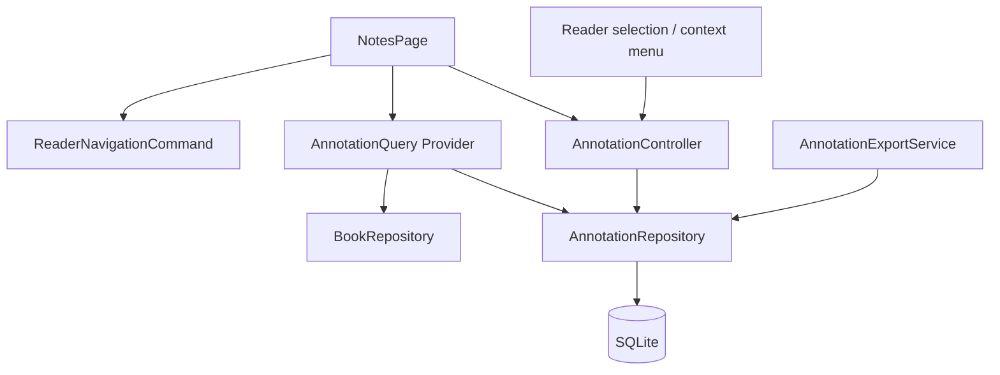

# TomoRead 全局笔记架构与实施计划

## 1. 文档目的与现状

本文定义“全局笔记”应如何从当前的静态页面升级为真实的阅读知识库。它复用阅读器已经写入的高亮和注释，不复制一份数据，也不让全局页面通过解析 EPUB 临时拼装事实。

当前基础：

- `reading_annotations` 已保存 `book_id`、`href`、`locator`、选中文本、注释、颜色和创建时间；
- `AnnotationRepository` 已支持按书读取、新增、修改注释文本、删除；
- EPUB 阅读器能使用 `href + locator` 跳转；
- `lib/features/notes/notes_page.dart` 仍是静态示例，不读取数据库。

参考 ReadAny 的标注类型与 store：

- `reference/ReadAny/packages/core/src/types/annotation.ts`
- `reference/ReadAny/packages/core/src/stores/annotation-store.ts`

本设计的核心决策是：**高亮和笔记是一条 Annotation 记录的两个维度**。高亮负责定位与摘录，笔记是可选的 Markdown 文本；不要在第一版拆成两个会互相同步的业务实体。

## 2. 产品范围

### 第一版必须交付

1. 将全局笔记页接入真实 `reading_annotations` 与书籍元数据。
2. 支持按关键词、书籍、颜色、是否有笔记、标签、创建日期筛选和排序。
3. 支持查看摘录、编辑 Markdown 笔记、维护标签、删除标注、打开原文。
4. 支持 EPUB 标注在全局笔记页和阅读器之间可靠回跳。
5. 支持导出当前筛选结果为 Markdown 和 JSON；导出过程不包含书籍文件。
6. 桌面端三栏高效浏览，移动端使用列表到详情的导航，而不是硬塞三栏。

### 后续版本

- PDF 文本标注的统一接入；
- 附件、图片、手写笔记、双向链接、知识图谱；
- 云同步所需的软删除、版本向量和冲突解决；
- FTS5 全文索引。当前规模用 SQLite `LIKE` 足够，先避免引入跨平台 FTS 差异。

## 3. 用户任务与信息架构

### 3.1 核心任务

| 任务 | 入口 | 成功结果 |
| --- | --- | --- |
| 回顾某书的高亮 | 全局笔记筛选书籍，或书籍详情页入口 | 看到按时间排序的摘录与笔记 |
| 记录想法 | 阅读器选区菜单或笔记详情 | 注释安全自动保存，标签可复用 |
| 回到原文 | 列表项或详情页“打开原文” | 跳到准确章节与 locator |
| 整理主题 | 搜索、标签、颜色、日期筛选 | 结果可跨书聚合 |
| 导出 | 筛选结果的更多菜单 | 得到可读 Markdown 或可迁移 JSON |

### 3.2 桌面布局

采用真正的工作台，而不是多个嵌套 Card：

1. **左侧筛选栏**：搜索、书籍、颜色、标签、仅含笔记、日期、排序。宽度 260-320 px，可沿用已有 `ResizablePane`。
2. **中间结果栏**：分页/无限加载列表，展示颜色、书名、章节、摘录前两行、笔记摘要、标签和时间。
3. **右侧详情栏**：完整摘录、书籍/章节来源、Markdown 编辑器、标签编辑、删除与打开原文。

窄桌面可隐藏左栏为抽屉；移动端先显示筛选后的列表，点击项进入全屏详情，筛选使用 bottom sheet。选中项必须同时在 URL/页面状态或 Provider 中保存，旋转/重建后不能误指向另一条记录。

### 3.3 必须覆盖的状态

- 第一次没有任何标注；
- 当前筛选没有结果；
- 读取失败；
- 标注对应书籍已被移除；
- locator 失效，无法回跳；
- 自动保存中、已保存、保存失败和重试；
- 导出中、导出成功、用户取消保存位置。

## 4. 分层与目录



建议目录：

```text
lib/
  domain/models/
    reading_annotation.dart              # 扩展现有模型
    annotation_query.dart
    annotation_page.dart
    annotation_tag.dart
  data/repositories/
    annotation_repository.dart           # 扩展，不新建第二个数据源
  data/services/
    annotation_export_service.dart
    annotation_location_resolver.dart
  features/notes/
    notes_page.dart
    annotation_controller.dart
    notes_providers.dart
    widgets/
      annotation_filter_panel.dart
      annotation_result_list.dart
      annotation_detail_pane.dart
      annotation_editor.dart
      annotation_tag_editor.dart
```

`ReaderWorkspace` 继续使用相同的 repository 和 controller。阅读器内部的“当前书标注列表”与全局笔记页不能拥有各自的缓存真相。

## 5. 数据模型与迁移

### 5.1 扩展领域模型

```dart
class ReadingAnnotation {
  // 保留已有字段
  final String id;
  final String bookId;
  final String href;
  final String locator;
  final String selectedText;
  final String? note;       // Markdown 源文本；空值代表仅高亮
  final AnnotationColor color;
  final DateTime createdAt;

  // 新增字段
  final DateTime updatedAt;
  final int? chapterIndex;
  final String? chapterTitle;
  final List<String> tags;
}

class AnnotationQuery {
  final String? text;
  final String? bookId;
  final Set<AnnotationColor> colors;
  final bool? hasNote;
  final Set<String> tags; // AND 语义；将来可扩展 any/all
  final DateTimeRange? createdAt;
  final AnnotationSort sort;
  final AnnotationCursor? cursor;
  final int limit;
}
```

列表不应返回裸 `ReadingAnnotation`。Repository 应返回 `AnnotationListItem`，将 annotation 与 `books.title/author/cover_path/format` 合并，避免 UI 对每一行查询一次书籍。

### 5.2 数据库

当前 schema 为 v7。以下迁移在没有其他新 migration 时可作为 v9（若 AI 先落地为 v8）；以最终合并顺序为准。

```sql
ALTER TABLE reading_annotations
  ADD COLUMN updated_at INTEGER;
ALTER TABLE reading_annotations
  ADD COLUMN chapter_index INTEGER;
ALTER TABLE reading_annotations
  ADD COLUMN chapter_title TEXT;

UPDATE reading_annotations
SET updated_at = created_at
WHERE updated_at IS NULL;

CREATE TABLE annotation_tags (
  annotation_id TEXT NOT NULL,
  normalized_tag TEXT NOT NULL,
  display_tag TEXT NOT NULL,
  created_at INTEGER NOT NULL,
  PRIMARY KEY(annotation_id, normalized_tag),
  FOREIGN KEY(annotation_id) REFERENCES reading_annotations(id)
    ON DELETE CASCADE
);
CREATE INDEX annotation_tags_tag ON annotation_tags(normalized_tag);
CREATE INDEX reading_annotations_created
  ON reading_annotations(created_at DESC, id DESC);
CREATE INDEX reading_annotations_book_updated
  ON reading_annotations(book_id, updated_at DESC, id DESC);
```

迁移实现要注意 SQLite 的限制：`ADD COLUMN` 后不能直接保证旧行拥有应用层需要的非空字段，因此读取时先做兼容 fallback，并在同一事务内完成 `updated_at` 回填。章节字段对历史记录允许为 `NULL`，不应为了回填而在升级时解析全部 EPUB。

标签使用独立表，而非 `tags_json`：可以索引、去重、按标签筛选，并且没有 JSON 字符串格式漂移。`normalized_tag` 使用 `trim().toLowerCase()`，`display_tag` 保存首次输入后的展示文本；标签长度限制 32 字符，每条标注最多 12 个标签。

### 5.3 历史数据与章节名

新建标注时，阅读器必须传入已有的 `chapterIndex` 和 `chapterTitle`。历史标注的章节字段为 `NULL` 时：

1. 列表显示 `未知章节`，仍可跳转；
2. 用户打开详情时，由 `AnnotationLocationResolver` 通过 manifest 的 `href` 找到章节并异步回填；
3. 回填失败不阻塞笔记编辑和导出。

这避免应用启动时对整库 EPUB 做昂贵扫描。

## 6. Repository 与状态管理

### 6.1 Repository API

```dart
abstract interface class AnnotationRepository {
  Future<AnnotationPage> query(AnnotationQuery query);
  Future<AnnotationDetail?> findById(String id);
  Future<List<AnnotationTag>> listTags({String? prefix, int limit = 30});
  Future<AnnotationFacets> loadFacets();

  Future<ReadingAnnotation> add(CreateAnnotationInput input);
  Future<void> updateNote(String annotationId, String? markdown);
  Future<void> replaceTags(String annotationId, List<String> tags);
  Future<void> updateLocationMetadata(String annotationId, ChapterMetadata value);
  Future<void> remove(String annotationId);
}
```

`query` 使用 keyset cursor，而不是无限增长的 `OFFSET`：默认排序为 `(created_at DESC, id DESC)`，cursor 保存最后一行的两个字段。更改排序/筛选后必须清空 cursor。文本搜索使用参数化 `LIKE`，不可拼接 SQL。

写入 `note` 与标签时必须使用 transaction，保证更新 `updated_at`、替换 `annotation_tags` 和返回详情的一致性。

### 6.2 Riverpod 边界

- `annotationRevisionProvider`：一个轻量 revision，不保存记录，只在成功写入后递增。
- `annotationPageProvider(AnnotationQuery)`：watch revision 后查询分页。
- `annotationDetailProvider(id)`：按需加载详情。
- `annotationFacetsProvider` / `annotationTagsProvider(prefix)`：为筛选器提供数据。
- `annotationControllerProvider`：命令式写入入口，负责校验、写库、revision 和错误转换。

现有的 `annotationsForBookProvider(bookId)` 可保留给阅读器，但应改为 watch `annotationRevisionProvider`。这样从全局笔记页编辑或删除后，打开中的阅读器高亮层也会更新；反向同理。

`HookConsumerWidget` 用 `useState` 保存当前 query、选择项 ID 和编辑草稿。不要为了编辑器状态创建新的全局数据库缓存，也不要回退到 `StatefulWidget`。

### 6.3 自动保存

笔记编辑器使用 700 ms debounce，并在以下时机立即 flush：切换条目、离开页面、应用进入后台、点击打开原文。保存失败时保留草稿，显示“未保存”并允许重试；不可静默丢弃。

输入为空白时保存为 `NULL`，并在 UI 中归类为“仅高亮”。编辑 note 不得改变 `selectedText`、颜色、locator 或 `createdAt`。

## 7. 回跳、删除与导出

### 7.1 打开原文

打开原文需要先验证书籍存在，再进入 reader 并使用 `ReaderNavigationCommand` 传递 `href + locator`。导航完成后阅读器 runtime 应反馈成功/失败；失败时详情页保留并展示“原始定位已失效”，同时提供按章节打开的降级入口。

列表点击和详情按钮的行为必须一致。全局笔记页面不能自行解释 CFI 或以 `progress` 猜位置。

### 7.2 删除

第一版是物理删除：二次确认后删除 annotation 和其 tags，阅读器高亮同步移除。没有同步之前不引入“回收站”或软删除字段，避免假恢复承诺。未来接入云同步时再通过独立 migration 增加 `deleted_at`、`revision` 和 tombstone 规则。

### 7.3 导出

`AnnotationExportService` 接受已固定的 `AnnotationQuery`，分页读取所有结果并生成：

- Markdown：按书籍分组，包含摘录、注释、标签、章节和创建时间；
- JSON：带 schema version 的完整结构，包含 locator，便于未来导入。

导出在 isolate/后台任务中构建；不能在 UI 线程拼接超大字符串。导出默认不包含封面、书籍文件、API Key 或任何 AI 会话。文件保存使用平台的保存位置选择能力，取消不应弹错误。

## 8. 实施阶段

### Phase A：真实数据列表

- 扩展 model、migration、repository 查询和 book join。
- 替换静态 `NotesPage`，完成桌面/移动端列表、空态、加载和错误状态。
- 验收：读者从阅读器新建高亮后，无需重启即可在全局笔记页出现。

### Phase B：详情编辑与筛选

- 完成 Markdown 草稿自动保存、标签、颜色/书籍/日期/文本筛选、排序与删除。
- 完成历史 annotation 的章节懒回填。
- 验收：任何筛选组合都不会混入其他书籍；编辑后阅读器侧面板同步更新。

### Phase C：导航与导出

- 完成可靠回跳、失效降级、Markdown/JSON 导出。
- 验收：导出的 locator 可读；从全局笔记页跳回 EPUB 后位置与高亮一致。

### Phase D：PDF 与同步预留

- 定义 PDF locator 适配；只有定位稳定后再接入全局页。
- 为云同步设计软删除和版本字段，不能提前破坏本地删除的简单语义。

## 9. 测试与验收

### 单元和 Repository 测试

- migration 后旧 annotation 可读取，`updated_at` 正确回填；
- 标签规范化、去重、替换、级联删除；
- query 的每种筛选、排序和 cursor 连续性；
- 更新 note 不修改不可变定位字段；
- 导出内容的排序、转义和 JSON schema version。

### Widget 与集成测试

- 列表空态、筛选、移动端详情、自动保存失败重试；
- 从 reader 创建 annotation 后全局列表刷新；
- 从详情点击原文，验证传给 Reader 的命令；
- 删除后 reader/bookmark panel/global list 同步刷新。

### 性能阈值

- 5,000 条标注下，首次筛选查询 p95 不高于 250 ms（本地桌面基准）；
- 列表按页读取，页面不一次性创建全部行；
- 编辑一条笔记不得触发全量 EPUB 解析或全库重查。

## 10. 不可违反的约束

- `NotesPage` 不直接访问 `sqflite`，也不持有第二份 annotations 列表真相。
- `href + locator` 是跳转定位的唯一权威；禁止从选中文本模糊搜索代替定位。
- 不把“有高亮”误展示为“有笔记”；`note == null` 必须可筛选。
- 没有真实持久化和导出前，不显示虚构的笔记数量、示例书名或无效操作按钮。
- 标签、笔记、导出和后续 AI 都应复用同一 `ReadingAnnotation` ID。
