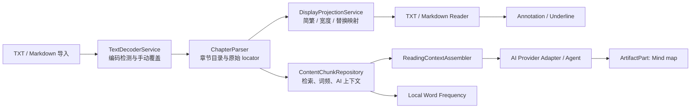

# TomoRead 阅读增强功能交接规格

> 状态：开发交接文档（2026-08-02）
>
> 目标：让开发者能够在不改变 TomoRead「本地优先、EPUB/PDF 原生阅读、可回跳知识记录」定位的前提下，逐项实现阅读细节功能。
>
> 参考范围：`reference/ColorTxt-main` 的产品行为，以及 `reference/ReadAny-main` 的模块边界与跨端经验。ColorTxt 参考目录未发现可供复用的许可证；不得复制其源码、资源、正则、文案或私有协议。ReadAny 为 GPL-3.0-or-later，若要复用任何代码，必须逐文件核对许可证、保留版权声明，并确认与本项目 GPL-3.0-only 的发布义务兼容；默认采用独立实现。

## 1. 交付目标与当前基础

这不是把 ColorTxt 或 ReadAny 移植到 Flutter。TomoRead 已有以下可复用基础：

- EPUB 的 Foliate.js runtime、CFI、章节 iframe、搜索、书签、彩色背景标注和笔记；
- PDF 阅读、目录和搜索；
- `ReadingAnnotation`、全局笔记、Markdown/JSON 导出及原文回跳；
- `reading_sessions` 驱动的阅读时长、连续阅读和统计；
- SQLite + Repository + Riverpod、系统安全存储、AI 对话、引用、Agent 工具和结构化 `ArtifactPart`；
- EPUB 文本前景色的独立配置、范围匹配和 CSS Custom Highlight 命名空间。

因此新功能必须复用现有书籍 ID、章节、locator、标注和会话模型；不得为方便展示而修改原 EPUB/PDF 文件，也不得将密钥、正文、字体二进制或大体积可视化数据塞进 `app_settings`。

| 能力 | ColorTxt / ReadAny 可借鉴点 | TomoRead 首版目标 | 依赖 |
| --- | --- | --- | --- |
| 划线笔记 | 选区操作、笔记列表和回跳 | EPUB 下划线标注，与背景高亮共用笔记和导出 | 已有 Annotation / CFI |
| 番茄时钟 | ColorTxt 的专注/短休/长休状态机 | 阅读器内专注计时、休息提醒、可选统计 | 阅读会话 |
| 自动编码识别 | ColorTxt 的文本文件导入体验 | TXT/Markdown 导入时检测、预览、手动覆盖 | 新文本解析管线 |
| 章节识别 | ColorTxt 的内置章节模式；ReadAny 的章节结构 | TXT/Markdown 的可预览、可修正章节目录 | 编码识别 |
| 文本替换、简繁、全半角 | ColorTxt 的展示层转换 | 可逆、仅展示层、保留原始 locator | 文本投影映射 |
| 系统/导入字体 | ReadAny 字体目录和 ColorTxt 平台字体栈 | 枚举可用系统字体、导入字体、每书覆盖 | 平台通道、WebView 资源服务 |
| 阅读助手 | ColorTxt 的上下文、可视化入口；ReadAny 的上下文服务 | 可引用、可防剧透、可回跳的 AI 阅读工作流 | 内容分块、Provider |
| 词云、思维导图 | ColorTxt 的本地词频和结构化 AI 输出 | 本地词云 + AI 导图 Artifact，支持导出 | 内容分块、Agent Artifact |
| 服务商预设 | ColorTxt 的预设目录；ReadAny 的专用 adapter | 预设选择、连接测试、模型拉取、能力声明 | AI Provider 重构 |

## 2. 不可破坏的总约束

1. 原始内容、展示文本和 AI 输出必须分开保存。任何替换、简繁转换、字体变色、词云停用词都属于展示或派生数据，不能覆盖原书。
2. 所有可跳回能力以原始 locator 为准：EPUB 使用现有 CFI/章节定位；TXT/Markdown 使用后文定义的原始偏移 locator。展示转换后仍必须能定位到原文。
3. EPUB、PDF、TXT/Markdown 的能力矩阵必须明确。不能因 TXT 的字符串处理简单，就将其规则直接注入 EPUB DOM 或 PDF 页面。
4. AI 是可选增强。本地阅读、章节目录、笔记、番茄时钟、基础词云均不得要求 API Key 或联网。
5. Provider 预设只包含公开的非敏感元数据；API Key、私有 Header、Cookie 和模型响应 ID 只进入系统安全存储或受控持久化字段。
6. Widget 只处理交互和渲染。解析、计时、平台字体、AI 请求、数据库读写均放入 Service / Repository / Riverpod Controller（本项目的 ViewModel）层。
7. 默认不执行本地编译、构建或测试作为任务验收前置条件；每项完成后应提交并推送。自动化测试可随功能补充并交由 CI 执行。

## 3. 总体架构与实施顺序



建议按以下阶段拆分 Issue；每阶段可以独立交付。

| 阶段 | 内容 | 原因 |
| --- | --- | --- |
| P0 | 下划线标注、番茄时钟、AI 服务商预设目录 | 复用现有数据模型，风险低，用户可快速感知 |
| P1 | 系统/导入字体、TXT/Markdown 编码识别与章节目录 | 为文本阅读器和后续内容管线建立可靠输入 |
| P2 | 展示层简繁/全半角/文本替换与原始偏移映射 | 必须先解决 locator 和选区一致性 |
| P3 | `content_chunks`、本地关键词检索、阅读助手上下文 | 为 AI 与可视化提供不依赖网页 DOM 的内容来源 |
| P4 | 本地词云、AI 思维导图、语义词云和高级 Agent | 建立在稳定内容、引用和 Provider 能力之上 |

## 4. 功能规格

### 4.1 划线笔记（EPUB 优先）

现有 `reading_annotations` 已能保存选区、颜色、笔记、章节信息和 locator。首版只需扩展渲染样式，不能新建一套笔记表。

**用户行为**

- EPUB 选区菜单新增“划线”；已有“高亮 / 添加笔记”入口保持不变。
- 用户可选择划线颜色，创建后可在阅读器、全局笔记页查看、编辑笔记、删除和跳回。
- 同一选区允许同时存在不同样式的标注；去重键不能只用 `book_id + locator`。
- 导出的 Markdown/JSON 应包含 `style: underline`，但不把视觉样式写入原文摘录。

**数据与渲染**

```sql
ALTER TABLE reading_annotations
  ADD COLUMN render_style TEXT NOT NULL DEFAULT 'highlight';
-- 可选值：highlight、underline
```

- 领域模型增加 `AnnotationRenderStyle`；旧记录一律映射为 `highlight`。
- EPUB runtime 继续使用 CSS Custom Highlight，但下划线命名空间或样式必须与搜索、背景高亮、文本前景色隔离。只设置 `text-decoration`、颜色和必要的线宽，不改写 iframe DOM。
- PDF 不随本 Issue 伪支持。待 `pdfrx` 的文本范围绘制与 locator 验证完成后，再单独实现 PDF 下划线。

**验收**：重启后可回跳；更换主题、分页/滚动、搜索、文本前景色开启时下划线仍存在；删除和导出不影响既有背景高亮。

### 4.2 番茄时钟与阅读专注

该能力是阅读辅助，不等同于阅读统计。计时器在应用进入后台、窗口失焦或设备锁屏后必须按绝对时间计算，不能依赖每秒回调累计。

**最小状态机**

- `idle` → `focus` → `shortBreak` / `longBreak` → `idle`；
- 默认建议：专注 25 分钟、短休 5 分钟、每 4 次专注后长休 15 分钟；均可配置；
- 支持开始、暂停、继续、停止、“提前结束休息”；阅读器顶部或底部显示紧凑倒计时；休息时使用不遮挡错误信息的提示层；
- 可选项：仅在阅读器可见时运行、结束通知音/系统通知、休息时暂停 TTS。默认不自动翻页、不自动开始下一轮。

**持久化与统计**

- 活动中的计时状态存入 `app_settings` 的小型 JSON（含 `phase`、`endsAtUtc`、`remainingMillis`、`completedFocusCount`、关联 `bookId`），恢复时以时钟重算；
- 历史记录使用独立 `pomodoro_sessions` 表，而非篡改 `reading_sessions`：`id`、可空 `book_id`、`phase`、`planned_millis`、`elapsed_millis`、`status`、`started_at`、`ended_at`；
- 只有用户实际在前台阅读时，才由现有 `ReadingActivityTracker` 写入阅读时长。番茄休息不算阅读时长，暂停的计时不虚增统计。

**模块**：`PomodoroTimerService` 管理时钟和生命周期；`PomodoroRepository` 管理配置/历史；`pomodoro_controller.dart` 发布不可变状态；Reader Widget 只订阅状态。

### 4.3 TXT/Markdown 自动编码识别与章节识别

EPUB 自带编码和目录、PDF 有独立文本层，二者不走本流程。此流程仅用于新引入的 TXT/Markdown。

**编码识别**

1. 先识别 BOM（UTF-8、UTF-16 LE/BE），再执行严格 UTF-8 解码；
2. UTF-8 不成立时，使用经过许可证审核的字符集检测/解码实现，候选至少覆盖 GB18030、GBK、Big5、Shift_JIS、EUC-KR、Windows-1252；
3. 返回 `encoding`、`confidence`、`hasReplacementCharacters` 和前 1–2 KB 预览；低置信度、二进制特征或替换字符过多时不自动确认，要求用户选择编码；
4. 用户选择作为该书的 `encoding_override` 持久化，重新解析后才更新章节和全文索引；原文件哈希不变；
5. 大文件检测、解码和章节扫描必须在 isolate 中执行，并可取消。

**章节识别**

- 先提供经过样本验证的内置模式：`第 + 中文/阿拉伯数字 + 章/回/卷/节/集/部/篇`、序章/楔子/后记/番外等特殊标题、`1、标题` 数字序号；
- 每条规则需展示命中数量、前 10 个预览和可能误命中的行；用户可启用/禁用内置模式并手动合并、拆分、改标题；
- 首版不允许任意用户正则直接在 UI 线程扫描整本书。高级自定义规则须在独立 isolate 中运行，有规则长度、数量、单行长度和扫描时间预算，并提供预览后才能保存；
- Markdown 优先用 ATX/Setext 标题，再以文本规则补充；文本章节的标题行和原始偏移都要保存。

**原始 locator**

TXT/Markdown 使用 `text:v1|chapterIndex|rawStart|rawEnd`。`rawStart/rawEnd` 是解码后、未进行简繁或替换前的 UTF-16 偏移；章节顺序变化时通过 `content_hash + chapter_id` 校验并提供迁移/失效提示，不能静默跳到错误内容。

推荐表：

```sql
CREATE TABLE text_content_profiles (
  book_id TEXT PRIMARY KEY,
  encoding TEXT NOT NULL,
  encoding_confidence REAL,
  parser_version INTEGER NOT NULL,
  content_hash TEXT NOT NULL,
  updated_at INTEGER NOT NULL
);

CREATE TABLE text_chapters (
  id TEXT PRIMARY KEY,
  book_id TEXT NOT NULL,
  ordinal INTEGER NOT NULL,
  title TEXT NOT NULL,
  raw_start INTEGER NOT NULL,
  raw_end INTEGER NOT NULL,
  source_rule_id TEXT,
  content_hash TEXT NOT NULL,
  UNIQUE(book_id, ordinal)
);
```

### 4.4 文本替换、简繁转换和全半角转换

该组能力必须是**展示投影**，不是“修改文件”。首版仅作用于 TXT/Markdown；EPUB/PDF 在 locator、选区和再排版边界得到专项设计前只显示“暂不支持”。

**规则**

- 简繁模式：关闭、繁→简、简→标准繁、简→台湾繁、简→香港繁；全半角按字母和数字分别控制；
- 采用经过许可证审核的 OpenCC 词典/实现，禁止手写单字符映射；地区转换是词组级转换，不能降级为简单 Unicode 替换；
- 文本替换首版只支持字面量全局替换和按书替换：最大 100 条/作用域、单条 200 字符、按优先级与最长匹配处理；不支持用户正则、AI 自动改写和直接写回；
- 规则有名称、启用开关、范围（全局/本书）、优先级、创建/更新时间；提供“本章预览”“恢复关闭”“复制原文”入口。

**投影和选区安全**

转换顺序固定为：`原始解码文本 → 简繁 → 全/半角 → 字面量替换 → 阅读器样式/文本前景色`。`DisplayProjectionService` 必须输出显示文本和 `raw ↔ display` 的范围映射；标注、复制原文、AI 引用、章节索引一律使用 raw 范围。

如果所选转换器无法提供可靠范围映射，必须通过保守分段或对齐算法标记该片段为不可精确映射；此时禁用“以此显示范围创建可回跳标注”，而不是写入错误 locator。每次变更规则后使显示缓存失效，但不重写原始内容、章节表和既有标注。

推荐表：`text_display_rules(id, book_id nullable, name, find_text, replace_text, enabled, priority, created_at, updated_at)`。`book_id IS NULL` 表示全局规则；在同一匹配位置，本书规则优先，然后按优先级和更长原文优先。

### 4.5 系统字体与导入字体

当前 `FontChoice` 只有系统/衬线/等宽三个逻辑项。要扩展为稳定的“字体引用”，不能把平台字体枚举结果写进 enum。

**能力边界**

- Windows：通过平台通道列出已安装字体的 family 与样式；macOS 使用 CoreText；Linux 使用 fontconfig；这些结果仅作为本机选择列表，不同步到其他设备；
- Android/iOS 不保证可枚举完整系统字体，首版只提供通用族、已导入字体和少量经过实际验证的候选字体；
- 支持导入 `.ttf` / `.otf` / `.woff` / `.woff2`，复制到应用数据目录，计算 hash，读取 family 元数据，允许删除未引用字体；
- 字体许可由用户负责。导入 UI 显示文件来源和许可提醒；预设下载字体仅收录许可明确、可再分发的字体，并把许可文本随资源保存；
- EPUB 和 TXT/Markdown 可应用阅读字体；PDF 不承诺替换 PDF 原有嵌入字体。

**数据和 WebView**

```sql
CREATE TABLE imported_fonts (
  id TEXT PRIMARY KEY,
  family TEXT NOT NULL,
  file_name TEXT NOT NULL,
  file_path TEXT NOT NULL,
  file_hash TEXT NOT NULL UNIQUE,
  format TEXT NOT NULL,
  source TEXT NOT NULL,
  license_label TEXT,
  created_at INTEGER NOT NULL
);
```

`ReadingFontRef` 取代直接依赖 enum：`generic`、`systemFamily`、`importedFontId`。EPUB runtime 中导入字体必须通过受控的本地资源服务提供 `@font-face`，不可把任意绝对文件路径交给 WebView；系统字体仅传递经转义的 CSS family stack。删除字体前检查全局和书籍覆盖引用，并提供替代字体选择。

### 4.6 阅读助手、服务商预设与模型能力

TomoRead 已能进行选区问答、解释、总结、引用回跳、工具调用和 Artifact 持久化。此项的重点不是重新做聊天页，而是补齐可验证的阅读上下文和可配置的 Provider。

**阅读助手首版**

- 预设动作：解释选区、总结当前章节、生成阅读问题、提取人物/术语、梳理时间线；用户仍可自由提问；
- `ReadingContextAssembler` 只能使用用户选定的选区、当前章节、明确选择的标注和已索引内容；每段上下文带 `bookId`、`chapter`、`locator`、内容哈希和字符预算；
- 默认开启“仅当前进度及之前章节”的防剧透范围；扩大范围必须让用户确认；
- 所有 AI 回答的书内事实必须带可点击引用；模型不能访问原始文件路径、系统字体路径、API Key、未授权书籍和任意 SQL；
- 当前 `ArtifactPart` 承载思维导图和词云等结构化结果，正文 Markdown 不混入可执行 HTML/JavaScript。

**Provider 预设目录**

预设是应用内版本化的静态目录，不含 Key、不保证某个模型一定可用，也不等同于“已实现专用协议”。选择预设时填入默认地址、认证类型和能力默认值；手动修改地址后显示为“自定义”，不得反向猜测厂商。

| 分层 | 预设/协议 | 首版处理 |
| --- | --- | --- |
| 本地 OpenAI 兼容 | Ollama、LM Studio | `localhost` 允许 HTTP；拉取模型失败时允许手输模型 |
| 云端 OpenAI 兼容 | OpenAI、DeepSeek、DashScope、智谱 GLM、Moonshot、SiliconFlow、MiniMax、OpenRouter、Gemini OpenAI 兼容 | 共用现有 Chat Completions adapter，预设地址和认证策略来自目录 |
| 自定义兼容 | 自定义 OpenAI 兼容服务 | 用户填写 HTTPS 地址、模型和非敏感 Header 名；敏感 Header 值进入安全存储 |
| 专用 adapter（后续） | OpenAI Responses、Anthropic Messages、Gemini 原生 | 以独立 adapter 实现 tools、reasoning、响应续接等差异，不能伪装为通用兼容接口 |

目录项至少包括：`id`、显示名、协议、默认 Base URL、认证类型（Bearer / `api-key` / none）、允许 HTTP 的 localhost 规则、是否可 `GET /models`、默认能力、官方文档 URL、弃用标志。模型列表以远端拉取或用户输入为准，不能把易过期的模型名硬编码成唯一可选项。

`AiProviderProfile` 应扩展 `presetId`、真实 `protocol`、`capabilitiesJson`、可选 `customHeadersSecretId`。SQLite 只保存安全存储引用；Provider Profile 支持多配置方案、测试连接、启用/停用和显式激活。测试连接只报告服务商 ID、HTTP 状态、时延与错误类型，日志不得包含 Key、Authorization、完整 prompt 或正文。

### 4.7 本地词云和 AI 思维导图

两者都依赖 `content_chunks`，但只有思维导图与语义词云需要 AI。

**内容分块前置**

- `content_chunks` 保存 `book_id`、章节、原始 locator 范围、文本 hash、ordinal 与文本；TXT/Markdown 从 `text_chapters` 产生，EPUB 从可信章节纯文本提取，PDF 等文本层稳定后再接入；
- 分块与索引任务记录 parser/index 版本、进度、错误和可重建条件；书籍内容或章节规则变化后只重建受影响分块；
- 本地关键词搜索、词频和 AI 上下文均从该表读取，禁止从当前 WebView DOM 抓取全书文本。

**词云**

- 首版为本地词频词云：用户选择当前章节、已读章节或整书；CJK 分词器、停用词表、最小词长、最大词数和范围在本地执行；
- 词频缓存按 `book content hash + chapter/range + tokenizer version + stopword version` 键入独立缓存表；未命中时在 isolate 计算，可取消；
- 语义词云是后续可选项：模型只从候选词中筛选与用户主题有关的词，最终频次仍由本地正文计算；
- Artifact 保存词项、频次、范围、配色、布局 seed、生成时间和内容 hash，支持 PNG/SVG/JSON 导出。更换 seed 只改变布局，不重新发送正文。

**思维导图**

- 由用户显式请求或在“章节总结后自动生成”开关下生成；默认关闭自动生成，避免隐性 Token 消耗；
- 要求模型返回受 JSON Schema 约束的树：`title`、`nodes[{id,label,children}]`、每个节点可选 `citations[]`；最大深度、节点数和标签长度均应在客户端验证；
- 将验证后的树保存为 `ArtifactPart` payload，并使用 Flutter 原生树/图渲染或受控的 sandbox WebView；禁止把模型原始 HTML 直接渲染；
- 节点引用可跳回原文，支持折叠、缩放、Markdown/JSON/PNG/SVG 导出。模型输出无效时保留普通文本回答并显示可恢复错误。

## 5. 推荐目录、职责与数据库迁移

```text
lib/
├── domain/models/
│   ├── annotation_render_style.dart
│   ├── pomodoro.dart
│   ├── text_content_profile.dart
│   ├── text_chapter.dart
│   ├── display_projection.dart
│   ├── reading_font.dart
│   ├── ai_provider_preset.dart
│   └── visual_artifact.dart
├── domain/use_cases/
│   ├── build_display_projection.dart
│   ├── detect_text_chapters.dart
│   └── build_reading_context.dart
├── data/services/
│   ├── text_decoder_service.dart
│   ├── chapter_parser_service.dart
│   ├── text_display_transform_service.dart
│   ├── font_catalog_service.dart
│   ├── pomodoro_timer_service.dart
│   ├── content_chunk_service.dart
│   └── word_frequency_service.dart
├── data/repositories/
│   ├── pomodoro_repository.dart
│   ├── text_content_repository.dart
│   ├── font_repository.dart
│   ├── content_chunk_repository.dart
│   └── visual_artifact_repository.dart
└── features/
    ├── reader/                 # 划线、番茄控件、字体应用
    ├── settings/               # 字体、转换、Provider、专注设置入口
    ├── text_import/            # 编码预览、章节规则预览
    ├── assistant/              # 阅读上下文与 Artifact 展示
    └── visualization/          # 词云/导图全屏查看与导出
```

- 所有写入通过 Repository 和 transaction；写成功后由相应 revision Provider 失效列表和阅读器状态。
- 长文本解码、章节扫描、分词、词云布局、OpenCC 批处理均放在 isolate 或可取消后台任务中，主线程只收到进度快照。
- 各新增 SQLite 表需要顺序迁移、创建索引、升级测试和旧数据默认值；迁移失败不能清空书库。
- 平台能力（字体枚举、通知、前台/后台时间、系统 TTS）经 `PlatformService` 接口封装，避免在 Widget 内写 `Platform.is...` 分支。

## 6. Issue 拆分与验收清单

1. `EPUB underline annotations and export style`：模型/迁移/runtime/UI/全局笔记闭环。
2. `Reader pomodoro state machine and persisted sessions`：后台恢复、休息提醒、统计边界。
3. `AI provider preset catalog and profile management`：预设、激活、多 profile、模型拉取、连接测试、密钥隔离。
4. `Desktop system font catalog and imported reading fonts`：平台列举、导入/删除、EPUB 受控资源服务、书籍覆盖。
5. `TXT Markdown decoder with encoding preview and overrides`：BOM、检测、手动覆盖、isolate 取消。
6. `Text chapter parser and raw locator contract`：内置规则、预览、人工修正、目录和进度。
7. `Display projection for Chinese conversion width and literal rules`：映射正确性、缓存失效、选区与标注保护。
8. `Content chunks lexical search and reading context assembler`：内容 hash、引用、进度防剧透。
9. `Local word cloud artifacts and export`：本地分词、缓存、范围、布局 seed。
10. `Structured AI mind-map artifact and citation renderer`：Schema 验证、渲染、导出、失败降级。

每个 Issue 至少应满足：范围外格式显式降级；取消、空态和错误态可见；不记录敏感数据；不改变既有书籍、标注和 locator；源代码与架构文档同步。按照当前项目约定，开发任务的本地验收为完成范围内改动、提交并推送；不要求本地编译、构建或运行测试。

## 7. 与现有文档的关系

- AI 运行、工具、Artifact 和 Provider 细节以 `ai-agent-implementation.md` 为主；本文件补充阅读助手、预设目录和可视化的产品边界。
- 内容检索、TTS、字体、同步的总体优先级以 `feature-gap-analysis.md` 和 `colortxt-feature-gap-analysis.md` 为主。
- EPUB 文本前景色的 `Range + CSS Highlight` 约束以 `reader-text-coloring-architecture.md` 为主；展示转换不得破坏该隔离。
- 全局笔记、标签、导出和跳转以 `global-notes-architecture.md` 为主；下划线只扩展现有标注样式。
