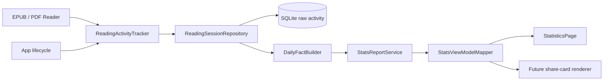
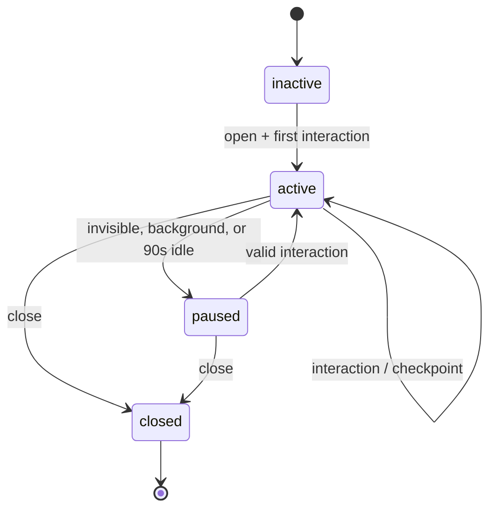

# TomoRead 阅读统计架构与实施计划

## 1. 文档目的与现状

本文定义 TomoRead 的阅读统计如何从展示型占位页面升级为可验证、可扩展、跨桌面和移动端复用的报告系统。

当前 `lib/features/statistics/statistics_page.dart` 中的数字、趋势图和热力图均是固定示例数据，应用没有阅读时长/会话原始数据。`books.progress` 是阅读位置，不可直接推导阅读时长、连续天数或每日活动。

设计参考 ReadAny 的正确分层：**原始阅读会话 -> 按日事实 -> 周期报告 -> ViewModel -> UI/分享**。TomoRead 将采用同样的方向，但先在 SQLite 上实时聚合事实，不在第一版过早引入物化汇总表。

参考：

- `reference/ReadAny/docs/stats-design/01-architecture-and-schema.md`
- `reference/ReadAny/docs/stats-design/03-implementation-roadmap.md`
- `reference/ReadAny/packages/core/src/stats/report-builder.ts`
- `reference/ReadAny/packages/core/src/stats/reports-service.ts`

## 2. 统计口径

统计先定义口径，再写 UI。以下规则是第一版的产品契约。

| 指标 | 定义 |
| --- | --- |
| 阅读时长 | 阅读器处于前台、可见且用户仍有阅读交互时累积的活动时间；不含菜单停留、后台、锁屏和超过闲置阈值的时间。 |
| 活动区间 | 一段连续的有效阅读时间，存为一行原始记录。不是“打开书籍到关闭应用”的粗略时长。 |
| 阅读会话数 | 以相邻活动区间间隔不超过 5 分钟聚合得到的会话数量。 |
| 阅读天数 | 当地阅读日中活动时长达到 60 秒的日期数。 |
| 当前连续 | 截止今天或昨天，连续满足“阅读天数”的自然日数；允许今天尚未阅读但昨天读过。 |
| 已完成书籍 | 在该统计周期内，进度首次从 `< 0.98` 达到 `>= 0.98` 的书籍数。 |
| 阅读进度变化 | `max(0, endProgress - startProgress)` 的累加，仅作辅助，不将回看章节误计为负阅读。 |
| 页数 | EPUB/PDF 的页面概念跨布局并不稳定，第一版不将其作为跨格式核心指标。 |

所有时间戳以 UTC 毫秒保存；每个活动区间额外保存会话开始时的 `timezone_offset_minutes`。报告按该 offset 计算历史“本地日”，避免用户在旅行或更改系统时区后旧记录整体换日。

## 3. 产品范围

### 第一版必须交付

1. 在 EPUB 和 PDF Reader 中准确采集前台有效阅读时长和位置变化。
2. 支持日、周、月、年、全部五个统计维度及前后周期导航。
3. 真实展示阅读时长、活动天数、连续天数、触及书籍、完成书籍、阅读趋势和热门书籍。
4. 统计页桌面与移动端共用同一份 `StatsReport`，只允许布局不同。
5. 应用崩溃/强杀后恢复未结束记录，最多损失最后一个 checkpoint 周期。
6. 数据只保存在本地，统计功能不调用网络。

### 后续版本

- 阅读目标、提醒、完成预测、年度报告分享图；
- 主题/书籍/作者维度；
- 云同步的合并策略；
- 统计数据导出；
- 按段落、词数或稳定位置单位统计的“阅读量”。

## 4. 分层架构



页面不能直接读取 sessions，也不能自行计算周界、连续天数、热力图或排行。所有维度都从同一个 `StatsReport` 出发，避免桌面和移动端结果不一致。

### 4.1 推荐目录

```text
lib/
  domain/models/
    reading_activity.dart
    stats_period.dart
    daily_reading_fact.dart
    stats_report.dart
    stats_view_model.dart
  data/repositories/
    reading_session_repository.dart
  data/services/
    reading_activity_tracker.dart
    daily_fact_builder.dart
    stats_report_service.dart
  features/statistics/
    statistics_page.dart
    statistics_controller.dart
    statistics_providers.dart
    widgets/
      stats_period_picker.dart
      stats_summary_grid.dart
      stats_chart.dart
      stats_top_books.dart
      stats_insights.dart
  features/reader/
    reader_reading_activity_scope.dart
```

`ReadingActivityTracker` 是应用服务，不属于 `StatisticsPage`。两个 reader 都必须经由同一套 scope 发送事件，不能各自写表。

## 5. 原始数据模型

### 5.1 为什么记录活动区间

仅记录“打开时间、关闭时间”会把用户离开电脑、切后台、停在设置菜单的时间算入阅读。为保证数据可信，一行 `reading_sessions` 表示一个连续、可计时的**活动区间**。短暂中断会产生多条区间，报告层再按 5 分钟间隔聚合成用户能理解的“会话”。

```dart
enum ReaderFormat { epub, pdf }

class ReadingActivity {
  final String id;
  final String bookId;
  final String sessionGroupId;
  final ReaderFormat format;
  final DateTime startedAtUtc;
  final DateTime endedAtUtc;
  final int activeMillis;
  final int timezoneOffsetMinutes;
  final double progressStart;
  final double progressEnd;
  final String? locatorStart;
  final String? locatorEnd;
  final int interactionCount;
}
```

`sessionGroupId` 只用于把短间隔的活动区间展示为一次会话；它不是 UI 状态，也不是 Reader 页面的生命周期 ID。位置字段保留为诊断、未来“阅读量”与恢复能力使用，不在第一版的报表页面展示。

### 5.2 SQLite schema

若 AI 和笔记 migration 已先后落地，这个迁移预计为 v10；真实开发以 `AppDatabase` 当前版本递增为准。

```sql
CREATE TABLE reading_sessions (
  id TEXT PRIMARY KEY,
  book_id TEXT NOT NULL,
  session_group_id TEXT NOT NULL,
  format TEXT NOT NULL CHECK(format IN ('epub', 'pdf')),
  started_at INTEGER NOT NULL,          -- UTC milliseconds
  ended_at INTEGER,                     -- NULL 代表崩溃前未正常结束
  active_millis INTEGER NOT NULL DEFAULT 0,
  timezone_offset_minutes INTEGER NOT NULL,
  progress_start REAL NOT NULL,
  progress_end REAL NOT NULL,
  locator_start TEXT,
  locator_end TEXT,
  interaction_count INTEGER NOT NULL DEFAULT 0,
  created_at INTEGER NOT NULL,
  updated_at INTEGER NOT NULL,
  FOREIGN KEY(book_id) REFERENCES books(id) ON DELETE CASCADE,
  CHECK(progress_start >= 0 AND progress_start <= 1),
  CHECK(progress_end >= 0 AND progress_end <= 1)
);
CREATE INDEX reading_sessions_time ON reading_sessions(started_at, ended_at);
CREATE INDEX reading_sessions_book_time ON reading_sessions(book_id, started_at DESC);
CREATE INDEX reading_sessions_group_time
  ON reading_sessions(session_group_id, started_at ASC);
```

第一版不创建 `daily_facts` 表。`DailyFactBuilder` 从有限日期范围内的 raw records 聚合，SQLite 可借助 `started_at` 索引先裁剪范围。等到实测统计页在 50,000 区间时超过性能阈值，再引入带明确失效策略的物化日事实表；不要在需求尚未稳定时维护两份事实来源。

### 5.3 崩溃恢复

开始阅读时先插入一条 `ended_at = NULL` 的记录；每 30 秒更新 `active_millis`、位置和 `updated_at`。应用启动时执行恢复：对未结束记录，以最后一次 `updated_at` 作为结束点，且最多补记 30 秒。不可把从上次更新时间到当前启动的间隔算作阅读时间。

## 6. ReadingActivityTracker

### 6.1 输入事件

Tracker 只接收经过 reader 语义化处理的事件：

```dart
abstract interface class ReadingActivityTracker {
  void open(ReaderIdentity identity, ReaderPosition initialPosition);
  void recordInteraction(ReaderPosition position, ReadingInteraction kind);
  void setVisibility(bool visible);
  Future<void> onAppLifecycle(AppLifecycleState state);
  Future<void> close();
}
```

有效交互包括翻页、滚动后停留、目录跳转、进度拖动完成、键盘/滚轮翻页和文本选择。仅移动鼠标、打开侧栏、Widget rebuild、WebView 回调抖动都不计为新的阅读交互。

### 6.2 状态机



规则：

- 首次有效交互才启动计时，避免用户打开书后放置不读就获得时长；
- 90 秒无有效交互即关闭当前活动区间；滚动阅读器可以每 20 秒由稳定位置变化提交一次“仍在阅读”事件；
- 应用 `inactive/paused/detached`、reader 被其他全屏页面遮挡、窗口失焦超过阈值时立即 checkpoint 并暂停；
- 每 30 秒 checkpoint，`close()`、切书、切格式、进入详情页时立即 flush；
- 进度倒退是允许的，不会删除历史时长，也不计为负阅读量。

实现必须使用 Hooks 订阅生命周期/Reader 回调，或封装成可在 `useEffect` 中注册的 scope。禁止为了 tracker 把 `ReaderWorkspace` 改成大量 `StatefulWidget` 生命周期代码。

### 6.3 防重复计时

一个 reader 页面只创建一个由 `bookId + format` 识别的 tracker session。Provider rebuild、横竖屏变化、工具栏显示/隐藏不得调用第二次 `open`。在同一 book 同时打开两个窗口的需求尚未支持；第一版在 application 级别按 `sessionGroupId` 去重并以最后活跃窗口为准。

## 7. 日事实、报告与 ViewModel

### 7.1 DailyReadingFact

`DailyFactBuilder` 将活动区间按记录的时区 offset 切分到本地自然日；跨午夜区间要按实际时间比例拆分，而不是全算到开始日。

```dart
class DailyReadingFact {
  final String dateKey; // YYYY-MM-DD，按记录时区
  final int activeMillis;
  final int sessionCount;
  final int booksTouched;
  final int completedBooks;
  final double progressDelta;
  final int firstActiveAtLocalMinute;
  final int lastActiveAtLocalMinute;
  final Map<String, DailyBookFact> books;
}
```

`completedBooks` 需要比较该书籍活动区间前后的 progress，且只在第一次跨过 0.98 时计数。若导入书籍时已经 100%，不应凭空计为完成。

### 7.2 周期报告

```dart
enum StatsDimension { day, week, month, year, lifetime }

class StatsReport {
  final StatsPeriod period;
  final StatsNavigation navigation;
  final StatsSummary summary;
  final List<ActivityPoint> activityTimeline;
  final List<TopBookEntry> topBooks;
  final List<StatsInsight> insights;
}
```

`StatsReportService` 是唯一允许理解周、月、年边界的地方，提供：

```dart
Future<StatsReport> loadReport({
  required StatsDimension dimension,
  required DateTime anchorLocalDate,
});
```

周起始日固定为周一，并写入测试。未来如增加偏好设置，应在 `StatsPeriodPolicy` 统一处理，不能散落在页面。

### 7.3 ViewModel

`StatsViewModelMapper` 将原始报告转换为 UI 模块：标题/周期标签、指标卡、折线/柱状/热力图数据、热门书籍列表、洞察文本。`StatisticsPage` 只能读取 ViewModel，不再包含 `_statistics`、演示热力格或手写模拟曲线。

使用本地化格式化（建议引入 `intl`）处理“1 小时 20 分钟”、日期和周期标签。不要把中文文案、日期格式或数值拼接散落进数据库服务。

## 8. 页面设计

### 8.1 桌面端

顶部有分段控件：日/周/月/年/全部，旁边是上一个、当前周期、下一个导航。未来日期禁止导航。内容按报告动态排列：

1. 一行摘要指标：阅读时长、活动天数/当前连续、触及书籍、完成书籍；
2. 主趋势图：日/周用活动时长折柱图，月用热力日历，年/全部用月/年柱图；
3. 热门书籍与简短洞察；
4. 无数据时使用真实空态，提示从阅读器开始计时，不展示假图表。

页面区域是全宽内容带，图表可放在单个工具容器内，但不要为每一段内容嵌套 Card。图表必须有语义摘要文本，不能只传达颜色。

### 8.2 移动端

同一份 ViewModel 按垂直顺序展示。周期切换可用横向 segmented control，日期导航使用图标按钮。热力图在小屏按固定单元尺寸横向滚动或简化为近 30 天，不应压缩到不可读。

## 9. Provider 与刷新策略

- `readingActivityTrackerProvider`：应用服务，注入 clock、repository，便于测试。
- `statisticsSelectionProvider`：只保存选择的 dimension 和 anchor date。
- `statisticsRevisionProvider`：每次 tracker flush 成功后递增。
- `statsReportProvider(selection)`：watch revision，调用 `StatsReportService`。
- `statsViewModelProvider(selection)`：由 report 映射，桌面与移动端共同使用。

报告读取应 debounce 150 ms，避免用户快速切换周期触发无用计算；旧请求结果不能覆盖新 selection。计算在数据量较大时转到 isolate，但 Repository/SQLite 连接不能跨 isolate 传递，需先读 DTO 再计算。

## 10. 实施阶段

### Phase A：原始活动采集

- 新建 migration、model、repository、可注入 clock 和 tracker。
- 接入 EPUB/PDF reader 的打开、交互、生命周期和 close。
- 实现应用启动的 orphan record 恢复。
- 验收：后台 10 分钟不增加阅读时长；翻页/滚动可产生非零记录；重启不会重复计算。

### Phase B：事实和报告引擎

- 实现 local-day split、session grouping、streak、完成书籍与五个维度 report。
- 编写边界测试后才接 UI。
- 验收：跨午夜、周一边界、月末、闰年、时区 offset、进度回退都得到确定结果。

### Phase C：真实统计页面

- 用 Provider 驱动替换现有固定数据；完成响应式布局、空/加载/错误状态和可访问图表摘要。
- 验收：同一测试数据在桌面/移动端显示相同数值；切换周期不闪回旧数据。

### Phase D：体验增强

- 目标、洞察、热门书籍跳转、年度报告分享卡、导出。
- 分享卡应接收 `StatsViewModel` 或专用 share model，不能截屏整个页面。

## 11. 测试清单

### 单元测试

- fake clock 下的开始、90 秒 idle、后台暂停、恢复、close 与 30 秒 checkpoint；
- orphan session 恢复上限；
- UTC 到历史本地日的切分、跨午夜比例、DST/offset 记录；
- 会话聚合、当前/最长连续、完成阈值、进度回退；
- 日/周/月/年/全部的 period 边界与 next/previous 导航；
- report -> view model 格式化。

### Widget 与集成测试

- 空数据、真实数据、维度切换、未来周期禁用、热门书籍跳转；
- Reader 操作后统计页自动刷新；
- EPUB 和 PDF 均能记录活动，但一次操作不会生成重复区间；
- 应用生命周期模拟后数值符合预期。

### 性能验收

- 10,000 条活动区间、查询最近一年报告的 p95 不高于 400 ms（桌面基准）；
- 统计页切换维度不阻塞滚动和动画；
- Tracker 高频事件不超过每 30 秒一次持久化写入，close 时额外一次。

## 12. 不可违反的约束

- 不能用 `books.progress`、示例常量或页面打开时刻伪造统计。
- 不能把后台、失焦和空闲时间计入阅读时长。
- 不能让 EPUB 与 PDF 各自创造不同的统计口径。
- 不在 `StatisticsPage` 中做日期边界、streak 或数据库查询。
- 原始统计数据是本地私有数据；未获得用户明确操作前不上传、不共享。
