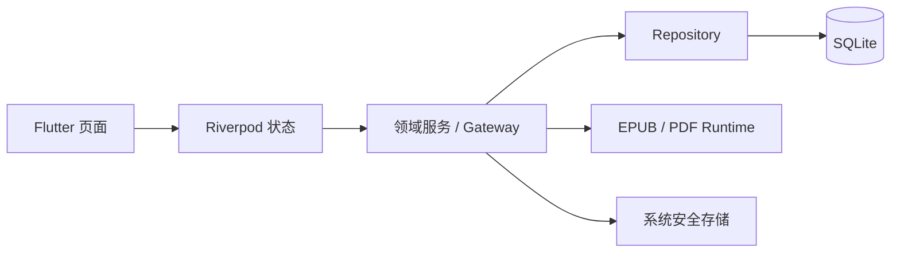

# TomoRead 核心架构

TomoRead 是一个本地优先的 Flutter 阅读器。应用支持 EPUB、PDF、TXT 与 Markdown；书籍、阅读位置、标注、笔记、会话与阅读统计保存在本机 SQLite，原始书籍由应用托管。

## 分层与数据流

- Widget 负责显示和交互；文件系统、数据库、平台 API 与网络请求只能由 Service、Gateway 或 Repository 访问。
- 耗时的导入、解析、索引和导出工作不得阻塞 UI isolate。
- EPUB 通过内置 Foliate.js runtime 渲染，PDF 使用 `pdfrx`。两类阅读器都必须通过可验证的定位信息与 Flutter 侧通信。
- 阅读位置、标注、笔记、搜索结果和 AI 引用都需要能回到原文；无法精确恢复时必须明确提示，不能静默跳到错误位置。

## 本地数据与隐私

书库的持久化数据包括书籍元数据、阅读进度、书签、标注、全局笔记、AI 会话、阅读活动和用户设置。导入书籍使用内容哈希去重；不修改用户的原始文件。

API Key、密码、令牌及其他凭据只保存到系统安全存储。它们不得写入 SQLite、日志、导出文件或错误提示。原文内容只在完成阅读、搜索或用户明确启用的 AI 请求所必需的范围内使用。

## AI 对话与引用

AI 功能使用可配置的 OpenAI-compatible Provider，并支持多个预设与配置档。对话以会话、消息、工具调用结果和引用为独立实体持久化；流式响应先建立可恢复的消息记录，再逐步写入增量内容。

阅读器入口和全局入口共享会话模型。传给模型的阅读上下文需受长度、当前阅读位置和防剧透规则约束；模型不能自行伪造定位信息。引用只能来自受信任的内容块，并包含可用于回跳的来源标识和 locator。

## 全局笔记

全局笔记统一展示来自各书的标注、摘录与独立笔记。它支持按书籍、标签、类型和时间筛选，编辑与删除通过 Repository 完成，并可导出 Markdown 或 JSON。每条与原文关联的记录都保留书籍、章节和定位信息；导出内容应包含足够的来源信息，便于再次打开原文。

## 阅读统计

统计基于前台有效阅读活动，而不是页面打开时长。活动跟踪器在用户实际阅读、失焦、锁屏、切换应用、切换书籍或退出阅读器时正确开启、暂停和结束区间。报表由原始活动记录聚合生成，支持按日期与书籍查看；重复事件和异常退出不得造成重复计时。

## 变更要求

涉及持久化时，必须提供顺序明确的数据库迁移、索引和旧库升级测试；不能通过清空书库规避迁移失败。新增功能应沿用现有的 Widget → Riverpod → Service/Gateway → Repository → SQLite 边界，并覆盖成功、空数据、取消和失败状态。
